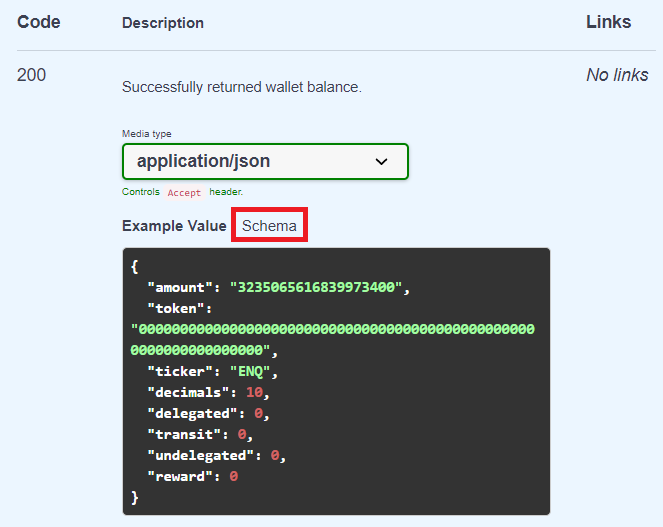

# API/Integration

## [API](https://app.swaggerhub.com/apis-docs/enecuum/EnecuumNodeAPI/1.0.0)

Enecuum's API is available on [Swagger.](https://app.swaggerhub.com/apis-docs/enecuum/EnecuumNodeAPI/1.0.0)

Enecuum's wallet creation is included in the introduction. Instructions on how to send transactions and generate signatures are available in POST /tx method. 

::: danger DANGER
ENQ has token hash/ID/transaction ticker of **0000000000000000000000000000000000000000000000000000000000000000**. Non-zero values mean that you deal with an asset other than Enecuum. Custom tokens have a random hexadecimal string as a token ID.
:::

::: danger DANGER
Rejected transactions are also recorded in the blockchain. Use GET /tx to check transaction status.
:::

Be aware that any wallet, including the one created for technical purposes, can receive referral rewards. This can happen if someone decides to use the wallet's referral address as their referral agent. These rewards are marked accordingly in the blockchain.

To get an explanation of the responses, refer to the response schemas. You can access them by clicking "Schema" next to "Example Value".

  

## Transaction Order

Enecuum's blockchain consists of macroblocks. Each macroblock contains a key block (kblock), microblocks (mblock), statblocks (sblock). Microblocks' hashes are sorted lexicographically in hexadecimal format. Microblocks contain transactions, which are also lexicographically sorted by hexadecimal hash.

## Custom Token Integration

In several API methods, token ID needs to be specified. For ENQ, the token ID is all zeros. If token ID is a random hexadecimal string, that means it's a custom token.

To send transactions with custom tokens, use POST /tx with the specified token ID. 

To check balance, use GET /balance method with the specified token ID.

To find out the custom token fees, total supply and other parameters, use GET /token_info with the specified token ID. The custom token fees are explained in the [Fee Principles](/enq/token-issue.md#fee-principles) guide.

## Get Last Transactions

To better understand Enecuum's blockchain structure, try this example. You can get a list of the latest transactions the following way: 

1. Use GET /height to get the last block number.

  

2. Use GET /macroblock_by_height with the previous block number as a parameter. You will get the contents of that block: keyblock, microblock, statblock. Only microblocks contain transaction. 

  

3. Use GET /mblock with the microblock hash as a parameter. You will get the list of transactions of that microblock.

  

