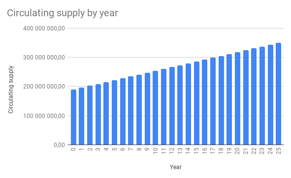

# ENQ Emission Model

## General Principles of the Emission

The total volume of all ENQs in the system will be 350,000,000.00 ENQ.

The total number of ENQ tokens [ERC-20](https://etherscan.io/token/0x16ea01acb4b0bca2000ee5473348b6937ee6f72f) was 126,880,563.75 ENQ.

The two phases of ENQ emission are the following.

### Step 1. The allocation of the ENQ(ERC-20)

1. 33,834,817 ENQ(ERC-20) are proposed to be available for sale under the ENQ Token Sale, which will be subject to the ENQ Token Sale terms and conditions. It is intended that it will be possible to exchange ENQ(ERC-20) for ENQ at a rate of 1:1, once the Enecuum adaptive decentralized environment is operational;
2. 25,376,112.75 ENQ(ERC-20) are proposed to be reserved for advisers and partners. It is intended that it will be possible to exchange ENQ(ERC-20) for ENQ at a rate of 1:1, once the Enecuum adaptive decentralized environment is operational;
3. 16,917,408.50 ENQ(ERC-20) are proposed to be reserved as a reward in test net and the Airdrop program. It is intended that it will be possible to exchange ENQ(ERC-20) for ENQ at a rate of 1:1, once the Enecuum adaptive decentralized environment is operational;
4. 50,752,225.50 ENQ (ERC-20) is proposed to reserve for seed investors. It is intended that it will be possible to exchange ENQ(ERC-20) for ENQ at a rate of 1:1, once the Enecuum adaptive decentralized environment is operational.

### Stage 2. Distribution of ENQ (after the main net will be launched)

1. 17,500,00.00 ENQ is proposed to be reserved as a reward to a team with a period of uniform unlocking for 1 year after the launch of the main network;
2. 45.500,000.00 ENQ is proposed to be reserved as a reserve fund with a period of uniform unlocking for 1 year after the launch of the main network;
3. 160,119,436.25 ENQ will be distributed among network participants (miners) within 25 years after the launch of the main network, as well as as a support to the miners network development program.

  

### Mining emission model

The total amount of ENQ available for mining and referral program rewards will be 160,119,436.25 ENQ.

ENQ data will be distributed within 25 years from the launch of the main network among PoW, PoS and PoA nodes, which will support the network and participate in the formation of a chain of blocks. Blocks will be created every 15 seconds.

Table of block generation and emission of new coins:

|        | Number of blocks | Emission, ENQ |
| ------ | ---------------- | ------------- |
| Minute | 4                | 12.19         |
| Day    | 5,760            | 17,547.34     |
| Year   | 2,102,400        | 6,404,777.45  |

### Block reward

The total block reward will be 3.046 ENQ, which will be distributed among the network nodes as follows.

|                       | PoW   | PoS    | PoA    | Referrals | Total   |
| --------------------- | ----- | ------ | ------ | --------- | ------- |
| Reward,%              | 5.00% | 55.00% | 31.81% | 8.19%     | 100.00% |
| Reward, ENQ per block | 0.152 | 1.676  | 0.969  | 0.250     | 3.046   |

Distribution of rewards between network nodes over time is presented below.

|                       | PoW          | PoS           | PoA           | Referrals     |
| --------------------- | ------------ | ------------- | ------------- | ------------- |
| Daily rewards, ENQ    | 877.37       | 9,651.03      | 5,581.19      | 1,437.75      |
| Yearly rewards, ENQ   | 320,238.87   | 3,522,627.60  | 2,037,133.53  | 524,777.45    |
| 25 Years rewards, ENQ | 8,005,971.81 | 88,065,689.94 | 50,928,338.25 | 13,119,436.25 |

### Inflation

Below is the emission model and annual inflation for 25 years.

   

| Year | Circulating supply | New emission | Inflation |
|:---:|:--------------------------:|:-------------:|:--------:|
|  0  |       189 880 563,75       |       0       |    0%    |
|  1  |       196 285 341,20       |  6 404 777,45 |   3,26%  |
|  2  |       202 690 118,65       |  6 404 777,45 |   3,16%  |
|  3  |       209 094 896,10       |  6 404 777,45 |   3,06%  |
|  4  |       215 499 673,55       |  6 404 777,45 |   2,97%  |
|  5  |       221 904 451,00       |  6 404 777,45 |   2,89%  |
|  6  |       228 309 228,45       |  6 404 777,45 |   2,81%  |
|  7  |       234 714 005,90       |  6 404 777,45 |   2,73%  |
|  8  |       241 118 783,35       |  6 404 777,45 |   2,66%  |
|  9  |       247 523 560,80       |  6 404 777,45 |   2,59%  |
|  10 |       253 928 338,25       |  6 404 777,45 |   2,52%  |
|  11 |       260 333 115,70       |  6 404 777,45 |   2,46%  |
|  12 |       266 737 893,15       |  6 404 777,45 |   2,40%  |
|  13 |       273 142 670,60       |  6 404 777,45 |   2,34%  |
|  14 |       279 547 448,05       |  6 404 777,45 |   2,29%  |
|  15 |       285 952 225,50       |  6 404 777,45 |   2,24%  |
|  16 |       292 357 002,95       |  6 404 777,45 |   2,19%  |
|  17 |       298 761 780,40       |  6 404 777,45 |   2,14%  |
|  18 |       305 166 557,85       |  6 404 777,45 |   2,10%  |
|  19 |       311 571 335,30       |  6 404 777,45 |   2,06%  |
|  20 |       317 976 112,75       |  6 404 777,45 |   2,01%  |
|  21 |       324 380 890,20       |  6 404 777,45 |   1,97%  |
|  22 |       330 785 667,65       |  6 404 777,45 |   1,94%  |
|  23 |       337 190 445,10       |  6 404 777,45 |   1,90%  |
|  24 |       343 595 222,55       |  6 404 777,45 |   1,86%  |
|  25 |       350 000 000,00       |  6 404 777,45 |   1,83%  |

## Block creation reward

### PoA mining

PoA (Proof-of-Activity) mining is available for owners of Android mobile devices.

To participate in PoA mining, an active balance from 25 to 25,000.00 ENQ is required. And also a running PoA node with ongoing Internet connection.

The total PoA reward is distributed among PoA publishers according to their stakes and the number of microblocks issued. Each PoA publisher receives a reward proportional to its stake in relation to the total stake of PoA publishers of the current block.

*poa_reward* = *block_reward* * *poa_stake* / *total_poa_stake* *

A predicted calculation can be done using the ROI calculator: [neuro.enecuum.com/#!/roi](https://neuro.enecuum.com/#!/roi)

After the launch of the main PoA network, miners will receive 31.81% of the rewards for blocks creation, which in absolute terms will be 50,928,338.25 ENQ for 25 years.

### PoS mining. Validators and Delegators

In order to become a PoS validator, you need to create a PoS contract with an ENQ balance, included in the top 100 — the rating of PoS contracts with the highest stake value — but not less than 25,001.00 ENQ. It is also necessary to start a server to participate in the creation of the chain of blocks. The PoS server should have constant connection to the Internet.

Any member of the network can become a delegator. To do this, at least 1 ENQ should be sent to a validator's PoS contract address. Sent funds will participate in the total stake and will receive a daily reward in ENQ. In this case, the delegator does not need to be in a constant Internet connection with the network.

Rewards for the block are calculated proportionally to the validator’s own stake and stakes received from delegators.

Each validator appoints a commission for self reward, which is charged automatically from the delegators. Commission can be from 0% to 100%.

The total reward for PoS miners (validators and delegators) over 25 years will be 88,065,689.94 ENQ. This is 55% of the total mining reward in the system.

Validators and delegates will also participate in the verification of transactions and will receive additional rewards from the system. The economics of this process are described [here](#fees-distribution).

### PoW mining

The work of PoW nodes consists of finding a *nonce* value for a block to obtain a block hash with the required complexity. The randomX algorithm is used for hashing. To start a PoW node, an Internet-connected server is required. The required complexity of the block grows with the number of nodes working in the network.

The total reward for PoW miners over 25 years will be 8,005,971.81 ENQ. This is 5% of the total reward for mining in the system.

## Transaction Rewards

After the launch of the Enecuum core network, transaction fees payment will be introduced. The cost of the commission will be equal to 0.1 ENQ for both the native coin and for tokens issued over the protocol.

It is worth noting here that token issuers themselves determine user commissions in the issued tokens, while the issuer uses ENQ for a payment for Enecuum miners work.

Consider an example.

Alice has released own *Alice Token* user token and has defined a user commission of 1 AT. This means that with every AT transfer Alice will receive 1 AT to her wallet. At this point, a commission of 0.1 ENQ will be automatically debited from the *Alice Token* address to pay for the miners work of adding the transaction to the blockchain.

### Fees distribution

All transactions in the Enecuum network are charged with a 0.1 ENQ fee. Fees for all transactions included into a block are summed up and distributed between network members that created this block — PoW and PoS leader, as well as between active PoS validators and genesis account according to the table.

The distribution will be as follows:

| Member | Distribution |
|:-------------------------------:|:-----------:|
| PoS Leader | 0.50% |
| PoW | 0.50% |
| Genesis | 3.00% |
| All PoS (validators and delegators) | 96.00% |
| Total | 100.00% |

The distribution between PoS validators and delegators will occur in the same way as for the reward for mining blocks - in proportion to thier stakes accounting validators commission.