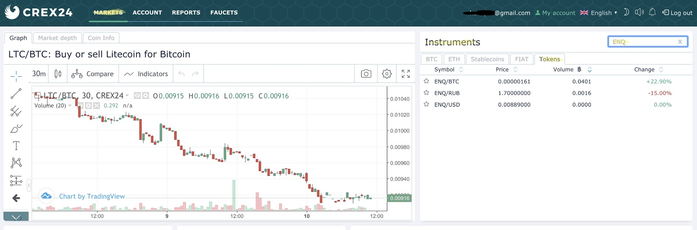
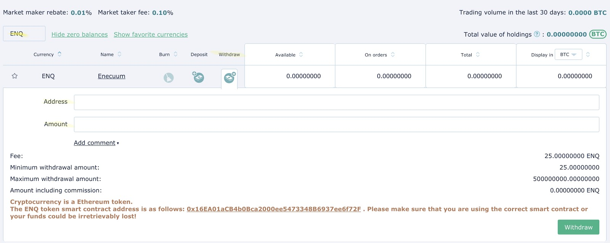
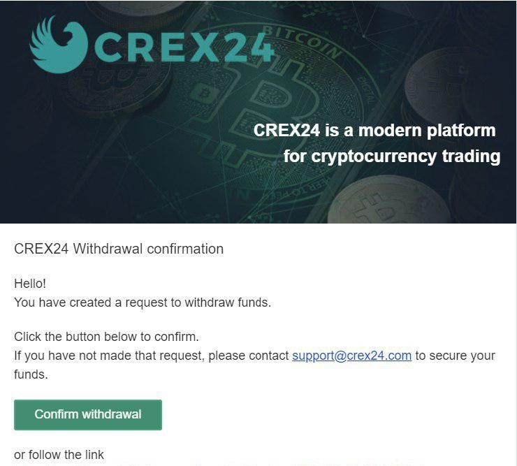

# How to Buy ENQ on Exchange

::: danger 
**Guide for buying a native ENQ is still in development. Text below is outdated and was relevant before the Main Net launch**
:::

::: tip
ENQ is available on [several exchanges](https://enecuum.com/buy). This guide explains how to buy ENQ on Crex24.
:::

## How to top up an account on [Crex24](https://crex24.com/)

Go to the "Account" page. Select currency in the search field. For example, USD. Then, in the  “Deposit” column click on the “+ with a cash picture” icon in front of the chosen currency for the top up. 

Payment methods:

- bank cards
- e-wallets
- payment systems

When you choose the service needed, a window will appear where you can enter the amount for the deposit. This window will also contain all the terms for the currency you’ve chosen. After entering the amount and agreeing with the terms, you will get switched to the transaction confirmation window. For the top up of some fiat currencies, you will need the account verification. On this stage, you will have detailed guides inside the exchange.

Commissions and minimal top up amounts will be shown in these windows. Be attentive. 

  

## How to buy or sell ENQ token

- Go to [Crex24 website](https://crex24.com/), click “Log in” in the menu and enter your data to log in the system. 

  

- In the “Markets” section enter ENQ (in the search field).

  

- Then we will see different ways of purchasing the tokens - for BTC, RUB, USD. Choose the right one for you. Below, in the “BUY ENQ” section, there will be a trading pair, if you choose USD in the previous step, this will be a pair ENQ/USD (or any other pair available that you chose).

- Go to ENQ/USD orders. In the book of orders choose the best price and quantity for ENQ. Click on it and data from this order will be moved to the “BUY ENQ” section.  

  

- During this step, you can edit the tokens quantity and price before finishing the order. If you are OK with the terms of the chosen order, then click “Buy”. After that, your order will get to the order book and will await for it to get completed. Later your transaction will be finished and ENQ tokens will appear on your balance. 

  

## How to withdraw funds

::: danger
**DO NOT SEND YOUR TOKENS DIRECTLY TO YOUR ENQ ADDRESS.** That WILL NOT work as intended.

After buying ENQ ERC-20 tokens, you need to **send it to an Ethereum wallet and perform a swap.** The swap is required because Enecuum is a testnet project which uses testnet ENQ coins that are not tradable. Please follow the guide below step-by-step. You will find the swap instructions at the end of the tutorial.
:::

- Go to the [Crex24 website](https://crex24.com/), click “Log in” in the menu and enter your data to log in the system. 

  

- Go to the “Account” section. Choose the currency - ENQ.

 

- Click on the “Withdraw” sign. Fill all the fields needed. **Please enter an *Ethereum* wallet address, NOT *Enecuum*.** Ethereum addresses start with *0x*, and Enecuum addresses start with *02* or *03*. For Ethereum wallets, we recommend MetaMask or Trust Wallet. 

 

- Follow the instructions in the email you receive.

  

- Next, to use ENQ in the app, please follow our [How to Swap ENQ](how-to-swap.md) guide. 

### Why can’t I withdraw my money?

1. Withdrawals can take up to 72 hours if the password has been changed. You will be notified about this by e-mail. If you did not change your password, please contact Crex24 [Customer Support Team](https://crex24.com/contact).
2. Crex24 has detected unusual traffic from your account. For additional protection withdrawal of funds may be limited. Please contact [the Customer Support Team](https://crex24.com/contact).
3. You are entering an Enecuum address instead of an Ethereum address. Notice that Ethereum addresses start with *0x*, and Enecuum addresses start with *02* or *03*.

If you have any questions, refer to [FAQ](/faq.html#buying-swapping). If none of these issues apply to you, you can read our FAQ's [troubleshooting section](/faq.html#buying-swapping-2) or contact us in the [Telegram group](https://t.me/Enecuum_EN).