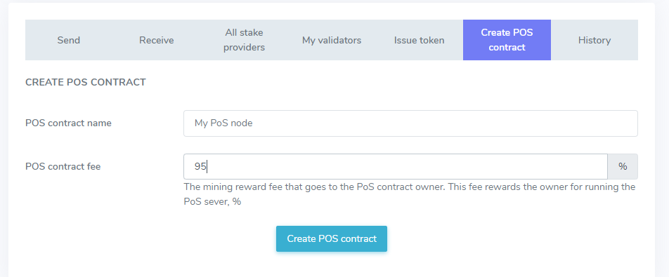
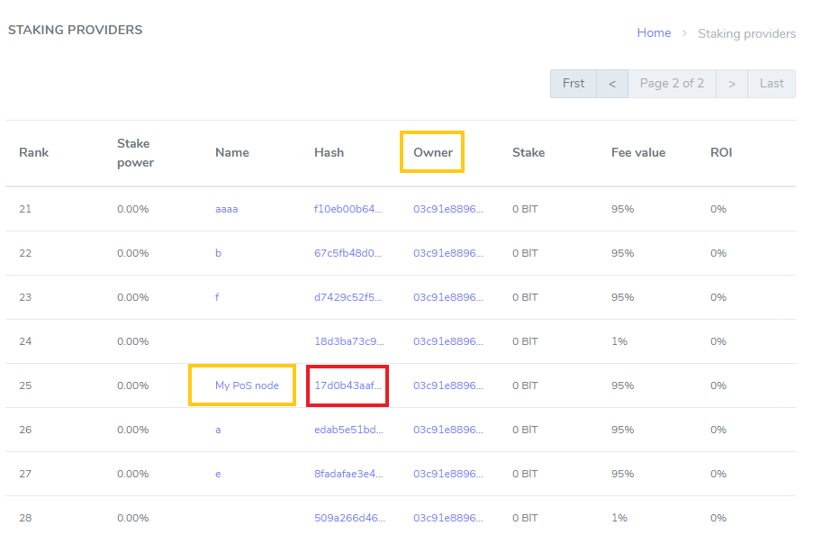

# How to Run PoS Node 

With Enecuum, it is possible to use the Trinity protocol (a combination of PoA, PoS and PoW) as well as functionality such as ETM (Enecuum Token Machine), delegation to PoS nodes (delegated smart staking), issuing of different types of tokens - mining, NFT and other.

## Staking and PoS Contracts

General idea of staking is depositing (or "delegating" as we call it below) your funds to PoS-nodes to increase their stake power to remain in top 100 wallets (as only the richest wallets are allowed to perform PoS work) for a share from PoS mining rewards. To guarantee it, this share is calculated thoroughly, and in time, PoS contracts are introduced. These contracts control delegated funds in a way that they can be used only for PoS mining and a delegator can always return coins. 

So if you want to run a PoS node you should create a PoS contract first (make a special transaction). Then, you can run a node - a piece of software associated with the PoS contract.

Think of it this way: when you create a PoS contact, you establish a bank. When you delegate your funds to a PoS contract, you open a bank deposit.

### Creating a PoS Contract

To create a PoS contract, use a [web-wallet](https://wallet.enecuum.com/) interface.

<p align = "center">  </p>

There two input fields. PoS contract name, which can be left blank, and a PoS contract fee. Contract fee determines the "salary" PoS owner receives for running a server. Choose it wisely, as if you set it too small, you can loose money paying for your sever; but if you set it too high, nobody will delegate funds to you and you can be out of top 100 with no earning at all. This commission percent will be adjustable in the future but with first release it cannot be changed after creation. 

After confirming PoS contract transaction and paying a transaction fee, please wait a bit. You will see a new record in the blockchain. Please find you contract at [PoS contracts page](https://neuro.enecuum.com/#!/pos-contracts). If your PoS name is blank, you can find your contract by owner address. It should be the wallet you used to send PoS contract creation transaction.

<p align = "center">  </p>

Click Hash value of your contract to copy your PoS contract hash (address).  In this test case, it is 17d0b43aafb141dbc4e36ae0abefc2b28b3979f96a84cdecf7e26dc25bd1c042, as can be seen in the figure above, marked with red. The hash will be used in the next step.

In oder for the contact to become active, you need to fulfill this requirements:

- delegate 25001 ENQ to the created contact yourself;
- be in the top 100 rating of wallets;
- run the PoS node.

### Delegating to Your PoS Contract

n order for the contract to become active, you need to delegate to it. A minimal self-delegated stake 25001 ENQ.

To find out how to delegate your funds, refer to [the according guide.](how-to-delegate.md)

### Running a PoS Node

#### Prerequisites 

::: tip
Note that PoW and Fullnode can only work with **public IP addresses.** The IP address can be static or dynamic.
:::

::: danger NOTICE
Current build nodes work stable only on Linux OS. There are network issues running nodes on Windows and Mac.
:::

- components are deployed through *Docker*, a platform meant for building, sharing, and running applications with containers. So first of all, [download Docker](https://www.docker.com/) for your OS using official guides. For Windows users, we recommend [Docker Toolbox](https://github.com/docker/toolbox/releases). Linux users can follow [Docker guide for Ubuntu.](https://docs.docker.com/install/linux/docker-ce/ubuntu/)

- After installing Docker, download the database that will be used in your Fullnode, PoW or PoS. **This is a mandatory step**.

  ```
  docker run -d --name pulse_db -e MYSQL_ROOT_PASSWORD=<your_db_password> enecuum/pulse_db
  ```
- Working with Docker is easy. The following list of commands should be enough for basic use:
	- stop the container: `docker stop <container-name>`;
	- show stopped containers: `docker ps -a`;
	- start the container: `docker start <container-name>`; 
	- show active containers: `docker ps`;
	- show logs: `docker logs <container-name>`;
	- show Docker disk usage: `docker system df -v`.
	

You can stop/restart the container without worrying; no data will be lost.

#### How to Run PoS

1. Carefully read the [prerequisites](how-to-pos.html#prerequisites) above. Check that you have the database installed:

   ```
   docker ps
   ```

   A container named *pulse_db* should appear:

   ```
   CONTAINER ID        IMAGE                      COMMAND                  CREATED             STATUS              PORTS             NAMES
   0f59855cf0ea        enecuum/pulse_db           "docker-entrypoint.s…"   6 seconds ago       Up 5 seconds        33060/tcp         pulse_db
   ```

   If you don't see the container in the list, please follow the instructions provided in the prerequisites.

2. Generate public and private keys using Enecuum App or [Web Wallet](https://wallet.enecuum.com/). Do a backup copy. You can use the same key pair for PoA, PoS and PoW.

3. Create a PoS contract via web-wallet as [this guide states](how-to-pos.md).

4. Download PoS container:

   ```
   docker run -ti --name pulse_pos --link pulse_db:dbhost -p8000:8000 -e POS_ID=<your_pos_id> -e PORT=8000 -e DB_PASS='<your_db_password>' -e PEER='95.216.68.221:8000' -e DB_PORT=3306 -d  enecuum/pulse_pos
   ```

   Change the `<your_pos_id>` parameter value to the PoS contract hash *without* brackets <>. You can use the hash from the previous step as the POS_ID parameter. Type your database password in `<your_db_password>`.

5. Check if your container is running:

   ```
   docker ps
   ```

   A list with *pulse_db* and *pulse_pos* containers should appear.

6. Search for your public key in the [Blockchain Explorer](http://neuro.enecuum.com/). You should be able to see new S-rewards. These are the rewards for your PoS node taking part in voting for a PoS leader. This process is stored in the blockchain in s-blocks. You can use Blockchain Explorer or [Web Wallet](https://wallet.enecuum.com/) to check your PoS balance. The installation is finished. If you need to, check logs using `docker logs pulse_pos` command. 


### View Your Delegators and Rewards

<p align = "center">  </p>

<p align = "center">  </p>

At PoS contract page, you can find the amount of delegated coins and rewards that your contract receives. Please note that rewards shown in the Blockchain Explorer are split between PoS owner and its delegators according to your PoS fee value. 