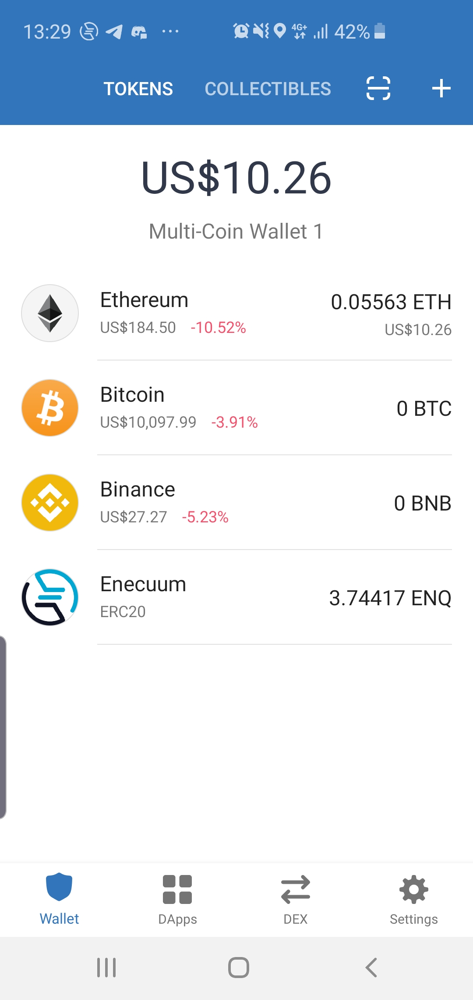
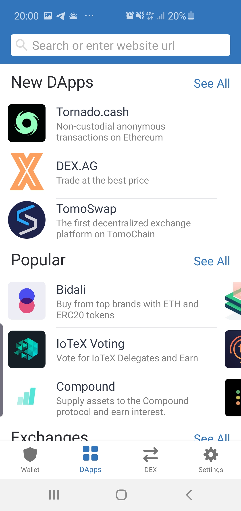

# How to Swap ENQ

::: warning NOTICE
To transfer ERC-20 ENQ tokens to the app or to sell mined ENQ **you need to perform a swap**. The swap is required because Enecuum is a testnet project which uses testnet ENQ coins that are not tradable. 

If you have bought ERC-20 ENQ tokens at an **exchange**, you should **withdraw** them to **your own Ethereum wallet** first and then perform a swap. More detailed exchange operations are covered in [How to Buy ENQ](how-to-buy.md) section.
:::

::: danger
The swap requires you to have an **Ethereum wallet** and **ETH for gas fee.** The gas fee is mandatory for ERC-20 ENQ -> testnet ENQ swap. For testnet ENQ -> ERC-20 ENQ swap, there are no fees.  You can buy Ethereum on exchange the same way you buy ENQ.  
:::

::: danger
Swaps work only if invoked via **[wallet.enecuum.com](https://wallet.enecuum.com)** interface. Do not try to send transactions to Enecuum swap technical addresses in either blockchain via direct API or from the mobile App. **This will NOT work as may be expected.**
:::

## How to Swap

To perform a swap, you need to acquire an Ethereum wallet. Below, we have provided tutorials for two wallets, MetaMask and Trust Wallet.

Depending on the operating system (OS) you have, please use MetaMask (Desktop OS) or Trust Wallet (Mobile OS) Ethereum wallets. This software has been tested by the Enecuum team and the community. We have separate guides for Trust Wallet and MetaMask, but they differ only in a graphical user interface of these wallets. The core mechanics provided by [wallet.enecuum.com](https://wallet.enecuum.com) are the same.

### ENQ (ERC-20) → ENQ (testnet) Swap

This direction swap converts [Ethereum ERC-20 ENQ tokens](https://etherscan.io/token/0x16ea01acb4b0bca2000ee5473348b6937ee6f72f) into ENQ coins to be used as a stake for Mobile mining in the [testnet](https://neuro.enecuum.com).

#### MetaMask (Desktop)

::: danger
To perform this swap, you are required to have **ETH for gas fee.** 
:::

You can watch a video tutorial or follow the guide below.

 <iframe width="560" height="315" src="https://www.youtube.com/embed/2SOaK6xQFGQ" frameborder="0" allow="accelerometer; autoplay; encrypted-media; gyroscope; picture-in-picture" allowfullscreen></iframe> 

To perform a swap, please:

- Install [MetaMask browser extension](https://MetaMask.io/).
- [Import Ethereum account into MetaMask](https://medium.com/publicaio/how-import-a-wallet-to-your-MetaMask-account-dcaba25e558d).
- Import ENQ (ERC-20) token into MetaMask using **0x16ea01acb4b0bca2000ee5473348b6937ee6f72f** token address:

 <iframe width="560" height="315" src="https://www.youtube.com/embed/9EfS3k7NPzg?start=84" frameborder="0" allow="accelerometer; autoplay; encrypted-media; gyroscope; picture-in-picture" allowfullscreen></iframe> 

- Go to the web wallet: [wallet.enecuum.com](https://wallet.enecuum.com).
- Log in with a private key of a testnet account with ENQ to swap.
- Choose swap tab in erc-20 -> enq swap direction.
- Press “Connect to MetaMask”:

  

- Enter a desired amount of ERC-20 tokens to swap, press “Swap ERC-20 ENQ”.
- If you want to send the transaction faster, please edit gas fee using "edit" button located at the right center of the pop-up window; confirm the transaction in MetaMask:

  

- There will be a pending transaction in the wallet history with no hash.
- After enough confirmations in the Ethereum blockchain status in history will be changed to “approved” and a transaction from Enecuum to your Enecuum testnet account will be sent.
- After enough confirmation in the Enecuum blockchain, your swap history status will be changed to “success”:

  

#### Trust Wallet (Mobile)

::: danger
To perform this swap, you are required to have **ETH for gas fee.** 
:::

To perform a swap, please 

- Install Trust Wallet app using [Google Play Store](https://play.google.com/store/apps/details?id=com.wallet.crypto.trustapp).  Set it up with the help of official [guides](https://help.trustwallet.com/hc/en-us/articles/360000973034-Trust-Everything-you-need-to-know-in-one-place).

- Navigate to DApps section:

  

- Enter “wallet.enecuum.com” address. Log in with you Private key from the Mobile App you want to deposit or withdraw:

    

- Enter a desired amount of ERC-20 tokens to swap, press “Swap ERC-20 ENQ":

 

- You can edit the gas price if you want to send the transaction faster:

  

- Finally, approve the transaction.
- There will be a pending transaction in the wallet history with no hash.
- After enough confirmations in the Ethereum blockchain, status in history will be changed to “approved” and a transaction from Enecuum to your Enecuum testnet account will be sent.
- After enough confirmation in the Enecuum blockchain, your swap history status will be changed to “success”:

  

### ENQ (testnet) → ENQ (ERC-20) Swap

This direction swap converts ENQ coins mined in the [testnet](https://neuro.enecuum.com) into [Ethereum ERC-20 tokens](https://etherscan.io/token/0x16ea01acb4b0bca2000ee5473348b6937ee6f72f). No additional software like MetaMask or Trust Wallet is needed, but we recommend using Google Chrome browser.

To perform a swap, please: 

- Go to the web wallet: [wallet.enecuum.com](https://wallet.enecuum.com).
- Log in with a private key of a testnet account with ENQ to swap.
- Choose swap tab in ENQ-> ERC-20 swap direction.
- Enter an amount to swap (should be greater than the minimal swap amount).
- Enter your Ethereum wallet address to receive ENQ (ERC-20) tokens:

  

- Click “Swap” and confirm transaction sending. This transaction will transfer your ENQ testnet coins to Enecuum reserved swap wallet:

  

- You will see this transaction in swap history with “pending” status:

  
 
 
- After enough confirmations in the Enecuum blockchain, the transaction status will be changed to “approved” and a transaction in the Ethereum blockchain will be sent:

  
 

- After enough confirmations in the Ethereum blockchain, the status of the transaction will be changed to “success”:

  
  

## Swap History Statuses

 <b>ENQ (testnet)  → ENQ (ERC-20) </b> 

| status   | description                                                  | caused by                                                    | triggers                                                     |
| -------- | ------------------------------------------------------------ | ------------------------------------------------------------ | ------------------------------------------------------------ |
| pending  | a transaction from user’s Enecuum wallet is sent             | sending swap transaction from web wallet                     | swap server checks Enecuum blockchain for transaction confirmation |
| approved | a transaction in Ethereum blockchain is sent to user’s Ethereum account | Enecuum transaction confirmation is seen by the swap server  | swap server checks Ethereum blockchain for transaction confirmation |
| success  | the transaction in Ethereum blockchain is confirmed          | Ethereum transaction confirmation is seen by the swap server | end of swap                                                  |
| rejected | the transaction in Enecuum blockchain is invalid (does not match the parameters set by a user in web wallet) |                                                              |                                                              |

 <b> ENQ (ERC-20)  →  ENQ (testnet) </b> 

| status   | description                                                  | caused by                                                    | triggers                                                     |
| -------- | ------------------------------------------------------------ | ------------------------------------------------------------ | ------------------------------------------------------------ |
| pending  | a transaction in Ethereum blockchain is sent to user’s Ethereum account | sending swap transaction from web wallet with Metamask confirmation | swap server checks Ethereum blockchain for transaction confirmation |
| approved | a transaction in Enecuum blockchain is sent to users wallet  | Ethereum transaction confirmation is seen by the swap server | swap server checks Enecuum blockchain for transaction confirmation |
| success  | the transaction in Ethereum blockchain is confirmed          | Enecuum transaction confirmation is seen by the swap server  | end of swap                                                  |
| rejected | the transaction in Ethereum blockchain is invalid (does not match the parameters set by a user in web wallet) |                                                              |                                                              |