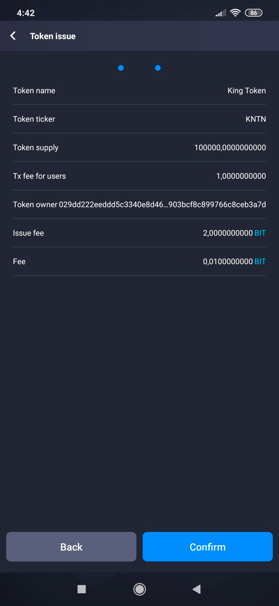

# How to Issue Own Tokens

With Enecuum, it is possible to use the Trinity protocol (a combination of PoA, PoS and PoW) as well as functionality such as ETM (Enecuum Token Machine), delegation to PoS nodes (delegated smart staking), issuing of different types of tokens - mining, NFT and other.

## Token Types

In the Enecuum network, there are three types of custom tokens:

- Non-reissuable - tokens with a fixed supply. After the token release, extra token coins can not be emitted.
- Reissuable - tokens with a flexible supply. After the token release, its supply can be changed by issuing or burning of coins.
- Mineable - tokens that can be mined. Some volume is selected for instant release (pre-mine), and the rest is mined by users.

### Common parameters

Each type of token has the following common parameters:

- Ticker - a unique token identifier 1-6 characters long. 
- Name - a token description up to 40 characters long.
- Token type - a type that determines token operation. The types are explained in the section above.
- Decimals - a number of decimal places.
- Emission - a token supply at the time of the issue. 
- Fee type -  a type that determines whether the fee is fixed or percentage.
- Fee - an exact fee amount for token transactions. The fee from each transaction will be sent to the wallet of the token creator.
- Min fee - a minimum fee for token transactions if the token type is percentage. 

### Mineable token parameters

Besides the parameters mentioned above, mineable tokens also feature the following: 

- Max supply - a maximum token emission. Upon reaching this number, the token can no longer be mined.
- Block reward - a reward for each mined macroblock. This number includes the referral reward. 
- Minimum stake - a minimum balance the user is required to have in order to start mining.
- Referrer stake - a minimum balance for the user to become a referral agent. After becoming a referral agent, the user can share a code to receive rewards from blocks mined by others. This system creates passive income.
- Referral share - a share of the total block reward that determines the referral reward amount. The referral reward is distributed among the referral and their agent equally.

### Token Calculator

You can use our [token calculator](http://neuro.enecuum.com/#!/token-roi) to estimate your return on mineable token investment. This tool can help you plan mineable token parameters based on your expectations. The calculator will predict how long it will take to mine your custom token and what the ROI will be depending on the premine value and the number of staked coins.

You can fill out the white fields with desired parameters. The calculated values will then be displayed in the blue-ish fields. The center column shows the token values, and the right column displays the same values converted in USD. Note that staked tokens is a user assumption only and is not related to blockchain functions.

Be aware that the mining period parameter is approximate. There are factors that are hard to take into calculation. For example, there is no guarantee that every mineable token miner will take part in each macroblock. So, the emission section is a rough estimation.

In order to save the page as a PDF file, click the button in the top-right corner and select "Print as PDF"

  

## Issue Tokens via Enecuum Network

You can create custom token via ENQ App or on your computer using our website.

### ENQ App

1. Go to [neuro.enecuum.com](https://neuro.enecuum.com/) and download the Android app via top menu. Navigate to How to mine -> Download app.
2. Create a wallet and save your secret key. Without a secret key, you can't recover your account.
3. Get ENQ tokens. You can buy ENQ on exchanges.
4. Open the app. Click on the icon in the lower right corner to access the token issue interface. This feature is provided to any Enecuum Network user. The issuing functions of new tokens are included in the protocol. The user is only required to specify the token parameters.
5. Fill out the required parameters.

  

6. Confirm the issuing of your new token. You will receive a message that tokens have been successfully created. 2.01 ENQ will be deducted from your account. 

  

7. Next, go to the "Token balance" tab on the Home screen. Here you can see ENQ and your newly created token balances.

### ENQ Wallet

1. Go to [wallet.enecuum.com](https://wallet.enecuum.com/). Login with your secret key or create an account. Make sure to save your secret key. Without it, you can't recover your account.
2. Get ENQ tokens. You can buy ENQ on exchanges.
3. At the end of the wallet page, there are several options available: "Send", "Receive", "History", "Token issue". Click the last tab.

  

4. Fill out the required parameters.

  

5. Confirm the issuing of your new token. You will receive a message that tokens have been successfully created. 2.01 ENQ will be deducted from your account. 

  

6. You should see a 2.01 ENQ transaction in the “History” tab. If the transaction status is “confirmed”, that means you have successfully issued your own token. Otherwise, there must have been an error in the filled-out parameters. 

  

## Errors When Creating Tokens

If you see an error when issuing your custom token, there can be several reasons:

- You do not have enough balance to issue the token. You need to have at least 2.01 ENQ.
- The token ticker is not unique. Try typing another ticker.
- The block reward is greater than the max token supply allows it. 
- The maximum token supply is less than the emission.
- The emission is less the referral stake.
- The referral stake is less than the minimum stake.
- You might have used restricted characters. Use a point (.) instead of a comma (,) when typing numbers. Only use English letters when choosing a token ticker.