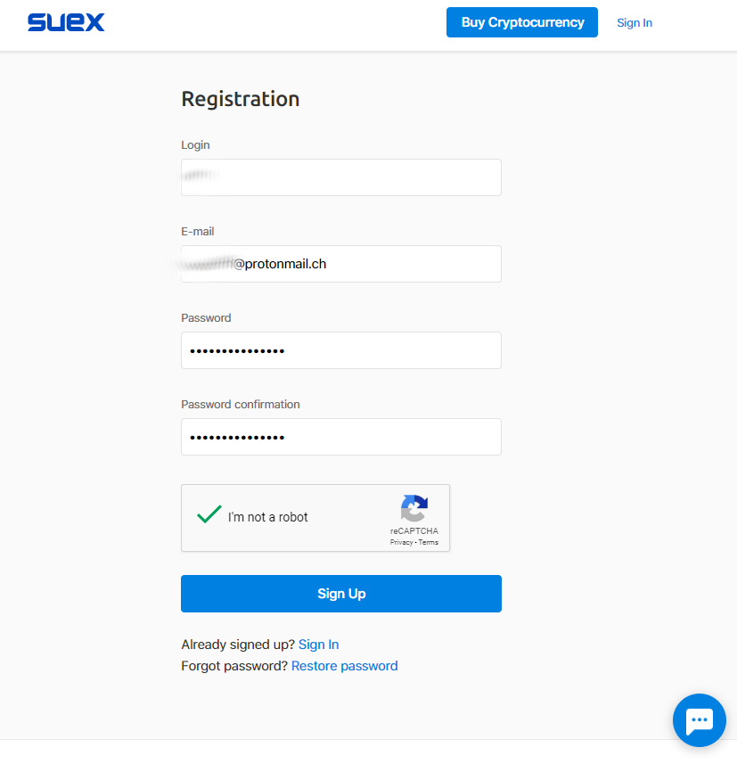
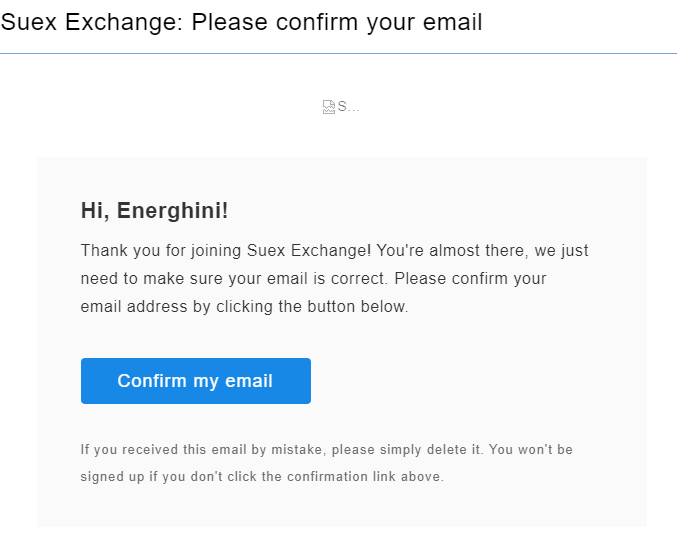
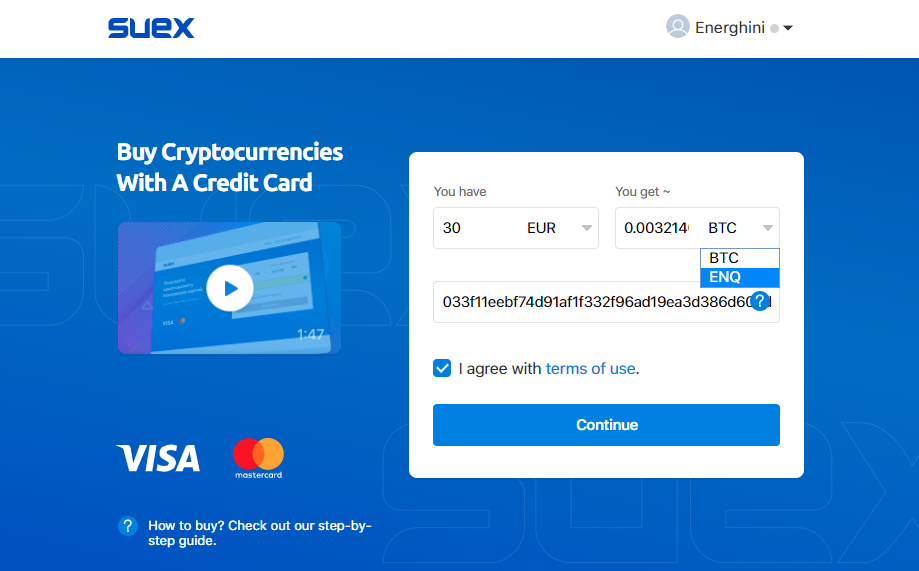
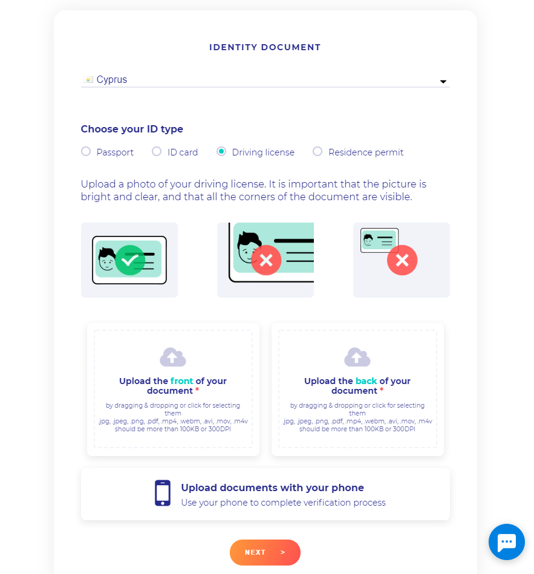
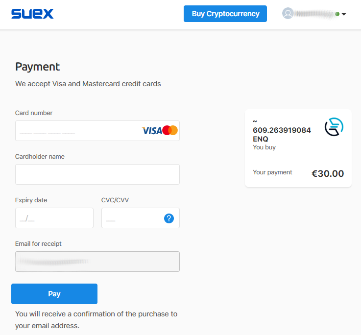
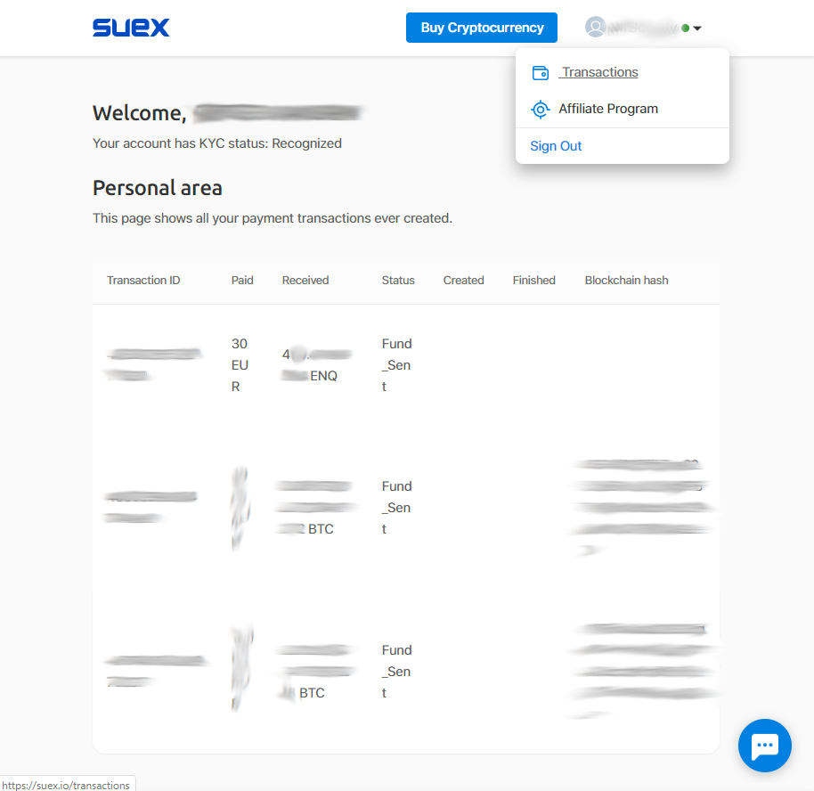

# How to Buy ENQ Using Bank Card

::: warning
The KYC procedure is required to buy cryptocurrency with a bank card. **Only residents of the selected countries are able to purchase.** Please contact suex.io support for additional info.

Notice you need to put down native ENQ address as the Destination address to receive the purchase. **Enecuum addresses start with *02* or *03*.** 
:::

::: tip
Buying ENQ native coins allows you to **start mining immediately.** No swap is required. Please follow the guide below step-by-step. 
:::

## How to buy native ENQ

There are two types of ENQ in nature. Ethereum-based tokens (we call them "ERC20 ENQ") that were used for the private sale in 2018 and also were listed at various exchanges and payment systems as the ERC20 standard provides ease of integration. Meanwhile, Enecuum independent network has been launched and is available for Mobile Mining with rewards in Enecuum network ENQ coins. We refer to them as "native". Our partner's gateway at [suex.io](https://suex.io/) currently is the only way to buy native ENQ straight out from the app without Metamask wallet or Ethereum gas. The other side of the coin is that native ENQ purchase requires KYC procedure and has restrictions to certain countries. If these terms are inappropriate to you, consider [buying ERC20 at an Exchange](how-to-buy) and then [perform a swap](how-to-swap).

## ENQ purchase with a bank card at [suex.io](https://suex.io/)

::: tip
Notice that SUEX has a **2 payments a day** limit.

In case SUEX website does not load, returns errors or does not operate properly, **clear your browser's cache** or enter the website using browser's **private window.**
:::

- Register at [suex.io](https://suex.io).
    - Fill in you Login, email and password.
      
    
  

      
    - Confirm your email.
    
    
  

    
- Pass KYC procedure (one-time step).
  
    - Load suex.io and order a purchase. Notice you need to put down native ENQ address as the Destination address. **Enecuum addresses start with *02* or *03.***
    
    
  

    
    - KYC procedure will start automatically.
    
    - Follow onscreen instructions and make front and back photos of your document and a selfie with it.
    
    
  

- Finally, make a payment with a bank card. Fill in your credit card information. 
  
::: warning
**In the Cardholder name field, enter the name that is shown in your profile.** Your profile's name should appear after the KYC procedure. To see it, click on your avatar and choose "Transactions".
:::
  

  

You can view your purchases history in the [Transactions](https://suex.io/transactions) section.

  

Suex support is available online via web page integrated support chat. To start a support chat click the bottom right corner icon.