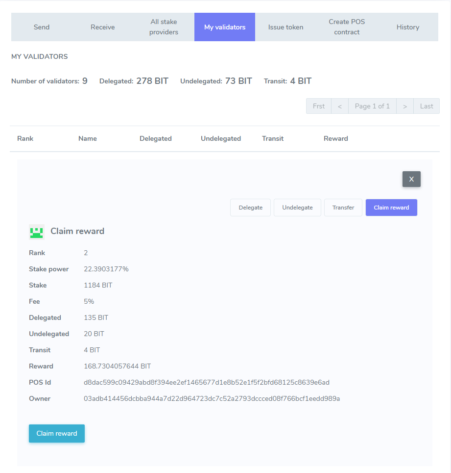

# How to Stake

BIT is a test network of the Enecuum blockchain. With BIT, it is possible to test the Trinity protocol (a combination of PoA, PoS and PoW) as well as new functionality such as ETM (Enecuum Token Machine), delegation to PoS nodes (delegated smart stacking), issuing and testing of different types of tokens - mining, NFT and other tokens.

The network is created for public testing for Enecuum community members, partners and developers of decentralized applications. All new features developed by the Enecuum team will be publicly tested in the BIT network and then added to the main network.

## How to use BIT

Go to bit.enecuum.com, download the Android app, create a wallet and save your secret key. Of course, you can also create an account from your computer at [bit-wallet.enecuum.com/login](). Transaction fees are introduced in BIT network, so you need to pay extra 0.01 BIT for every "write access" to the blockchain. Like creating PoS-contract or claiming PoS-staking rewards. To pay these fees you can get BIT coins from [faucet-bit.enecuum.com]() (25 BIT in every 10 minutes from one address).

## Staking and PoS-contracts

General idea of staking is depositing (or "delegating" as we call it) you funds to PoS-nodes to increase their stake power to remain in top 100 wallets (as only richest wallets are allowed to perform PoS work) for a share from PoS mining rewards. To guaranty this share is calculated thoroughly and in time PoS contracts are introduced. These contracts control delegated funds in a way that them can be used only for PoS mining and a delegator always can return coins. To receive additional returns from coins you hold you should delegate them to an active PoS contract. Active means that there are a PoS node (server) running and this PoS contract is in top 100 contracts by their stake power.

::: warning NOTICE

Only system native coins and only integer amount of the coins are available for delegating, undelegating and transfer. This is done by design of the system to achieve performance and scalability goals. So minimum 1 BIT(ENQ) is possible to stake.

## Staking via web wallet

You can manage you funds staked via mobile app or web interface. Let's start with web wallet. First of all log in to you web wallet and make sure that you have not only funds to delegate but also to pay transaction fees.

### Delegate 

Choose PoS contract (stake provider) you want to delegate.  Main parameters to consider are PoS contract fee and PoS node uptime. Like how much coins you should share with PoS owner is determined by the fee value and how often this PoS contract receives rewards for its delegators is shown by uptime number. At first release we will only show PoS contract rewards history to estimate the uptime by eye. Detailed statistics will be added step by step.

  

After delegation your total balance remain unchanged, but delegated amount of coins moves from "available" to "delegated" balance. You can not use delegated funds as they work in PoS mining until you undelegate them. But this funds is still shown in your total balance as no one can use your funds either.

### Undelegate

"My validators" tab shows balances of delegated funds to PoS contracts. You can manage each PoS contract   to receive reward or stop delegating. Choose "undelegate" option to withdraw integer number of coins from "delegated" to "available" balance. 

  

::: warning NOTICE

Undelegation takes 2 transactions to be performed so you need to pay 2 standard transaction fees.

### Transit

This is not an action but a state of you coins after undelegation transaction. There is a time lock between you order undelegation and your coins are available to be taken from PoS contract to your available balance. This time lock guarantees fair rewards calculation eliminating possibility to use one coin in to PoS contacts simultaneously. 

  

### Transfer

To finish undelegation procedure you should transfer undelegated coins from PoS contract to you available balance. You should make one transfer transaction for each undelegation transaction after time lock passes.

  

### Claim reward

Finally you can claim your reward anytime it is not zero. Use "My validators" -> "Manage" -> "Claim reward" menu.

  

## Balances

As a result of a presence of 5 states for you coins there 5 balances available.

-   Available: just coins you can use freely. Delegate them for instance $_$.

-   Delegated: coins you moved to a certain PoS contract to receive rewards if the contract belongs to an active PoS.

-   Transit: coins you ordered to undelegate from a PoS contract, but not so long ago that time lock is still active.

-   Undelegated: coins that a free to be transferred to available balance with a "transfer" transaction.

-   Reward: this is what you have earned for delegating funds, but this rewards should be transferred explicitly to your balance. We plan to make this move automatic with Staking 2.0 features. 

    
  
