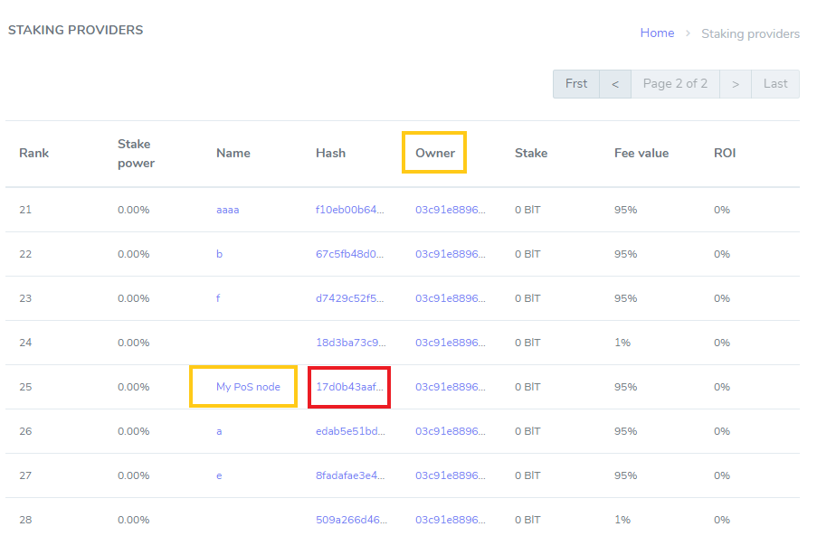

# How to run PoS node 

BIT is a test network of the Enecuum blockchain. With BIT, it is possible to test the Trinity protocol (a combination of PoA, PoS and PoW) as well as new functionality such as ETM (Enecuum Token Machine), delegation to PoS nodes (delegated smart stacking), issuing and testing of different types of tokens - mining, NFT and other tokens.

The network is created for public testing for Enecuum community members, partners and developers of decentralized applications. All new features developed by the Enecuum team will be publicly tested in the BIT network and then added to the main network.

## How to use BIT

Go to bit.enecuum.com, download the Android app, create a wallet and save your secret key. Of course, you can also create an account from your computer at [bit-wallet.enecuum.com/login](). Transaction fees are introduced in BIT network, so you need to pay extra 0.01 BIT for every "write access" to the blockchain. Like creating PoS-contract or claiming PoS-staking rewards. To pay these fees you can get BIT coins from [faucet-bit.enecuum.com]() (25 BIT in every 10 minutes from one address).

## Staking and PoS-contracts

General idea of staking is depositing (or "delegating" as we call it below) you funds to PoS-nodes to increase their stake power to remain in top 100 wallets (as only richest wallets are allowed to perform PoS work) for a share from PoS mining rewards. To guaranty this share is calculated thoroughly and in time PoS contracts are introduced. These contracts control delegated funds in a way that them can be used only for PoS mining and a delegator always can return coins. So if you want to run a PoS node you should create a PoS contract first (make a special transaction). Than run a node (run a piece of software associated with the PoS contract).

## Creating a PoS contract

There is a create PoS interface in a web-wallet.

<p align = "center">  </p>


There two input fields.  PoS name can be left blank, but contract fee determines the "salary" PoS owner receives for running a server. Choose it wisely as if you set it too small you can loose money paying for your sever, but if you set in too high, nobody will delegate funds to you and you can be out of top 100 with no earning at all. This commission percent will be adjustable in future but with first release it cannot be changed after creation. 

After confirming Create PoS contract transaction (and paying a transaction fee) please wait a bit for appearing it in the blockchain. Please find you contract at https://bit.enecuum.com/#!/pos-contracts . If you left PoS name blank find you contract by owner address, it should be the wallet you used to send PoS contract creation transaction.

<p align = "center">  </p>

Click Hash value of your contract to copy you PoS contract hash (address).  In the test case is ```17d0b43aafb141dbc4e36ae0abefc2b28b3979f96a84cdecf7e26dc25bd1c042```. It will be used at the next step.

## Delegating to your PoS contract

There is a minimal self-delegated stake to be introduced later but with initial release no self-delegating is required. So you can skip this step, just create a PoS contract and run a node. But if you want to increase your rewards you can delegate to you own PoS contract in the way any other delegation takes place **(LINK_TO_DELEGATION_GUIDE)**

## Running a PoS node

Follow the https://guides.enecuum.com/how-to-mine-bit.html#how-to-run-pos guide with POS_ID parameter equals to the hash from the previous step. 

## View your delegators and rewards

At PoS contract page you can find the amount of delegated coins and rewards that you contract receives. Please note that rewards shown in the Blockchain Explorer are split between PoS owner and its delegators according to your PoS fee value http://bit.enecuum.com/#!/pos-contract/17d0b43aafb141dbc4e36ae0abefc2b28b3979f96a84cdecf7e26dc25bd1c042