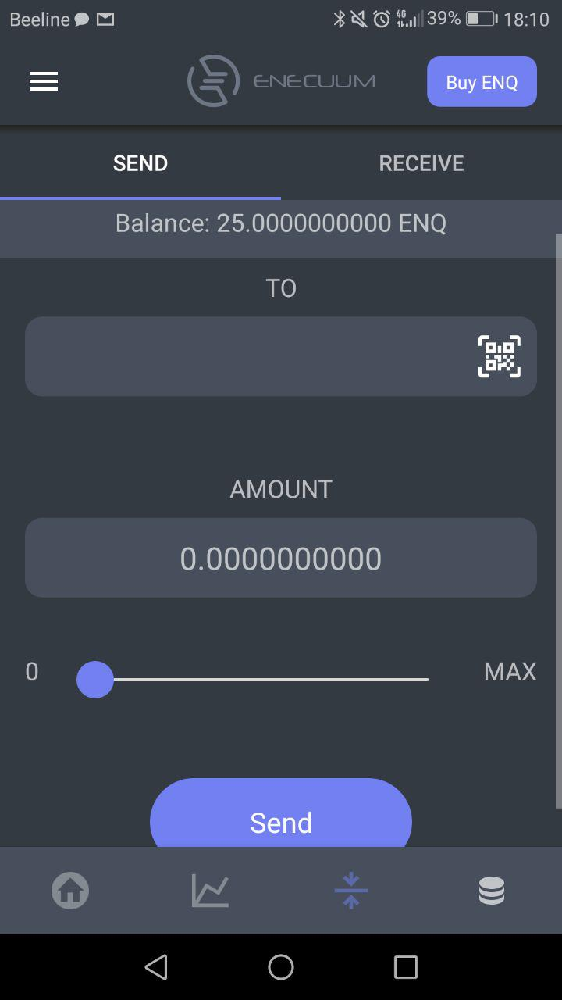
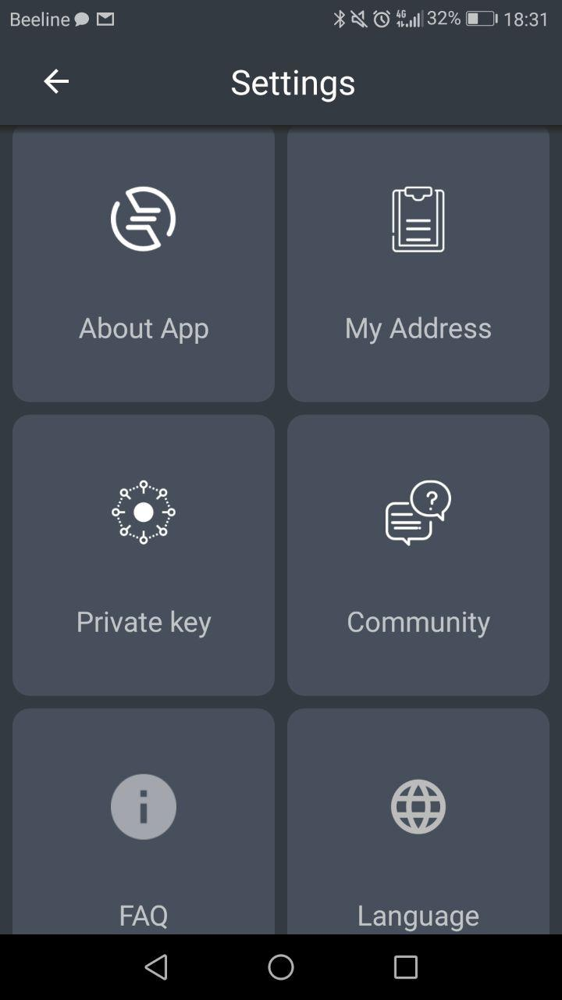

# How to Use the App

## How to Use Mobile Masternode

1. Go to [enecuum.com](https://enecuum.com/).

2. Download the application. You can use [app.enecuum.com](https://app.enecuum.com/) for the direct download. Install it via your device’s file manager.

3. Following the on-screen instructions, create a Private Key (**it’s important to save your private key** - otherwise you won’t be able to access your funds).

## Application Overview

There are 4 main screens in the application available by pressing these buttons:

  

### Screen 1. Balance & Start Activity Button

This is the main activity screen. In order to start mining, click on the START ACTIVITY and your device will start earning coins for you. **Notice that you should own at least 25 ENQ to mine**. This is an antispam measure as well as an additional value to the ENQ. If you don’t have any, you can buy it on the [exchange](how-to-buy.md), with a [bank card](how-by-card.md) or join Enecuum bounty program (social networks activities, application bugs search, code contribution, etc.) and earn some ENQs to start mining. 

  

### Screen 2. Blockchain Explorer

Here you can see the map and check out how many people from which countries are using the application at the moment. There is also information about the actual TPS (transactions per second), max TPS, PoA, PoS and PoW nodes quantity. 

  

### Screen 3. Send/Receive ENQs

Here you can send your ENQs to another wallet. You can also receive ENQs using the same screen by choosing “receive” option. To send tokens enter the receiver’s ENQ wallet address (he can find it in “My address” section in Settings as well at in “Receive” screen), and enter ENQs amount to send. To receive some tokens copy your own ENQ wallet address or share QR code with the person who wants to send you ENQs. 

  

### Screen 4. ROI Calculator

ROI calculator helps you see how many ENQs you can mine daily, weekly, monthly and yearly. It is very easy to check the profit just by entering the stake amount (how many ENQs you start mining with). You can *tap on your balance* or *Max ROI* to see ROI calculation for it. To find out how it works, please refer to the [ROI guide](how-does-roi-work.md).

  

### Other screens

#### Buy ENQ

Here you can buy more ENQ. Just choose the exchange and follow up the [instructions](how-to-buy.md). 

  

#### Settings

Settings are hidden by this sign of 3 horizontal lines in the top left of your screen. The following settings are available: 

  

- **About App.** Here you can check your actual app version and find the links of the important documentation of Enecuum.
  
- **My Address.** This section shows your ENQ wallet address. You can copy it easily if needed. 

- **Private Key.** Private key is needed to access your funds via mobile app or the web wallet. **Make sure to save it**.

- **Community**. Link to Enecuum social networks. Join them to stay tuned on all the Enecuum updates

- **FAQ.**  Here we placed all the important information on the frequently asked questions from our community.

- **Languages.** Switch Enecuum app to any language you like. We already have 9 and will add more soon.