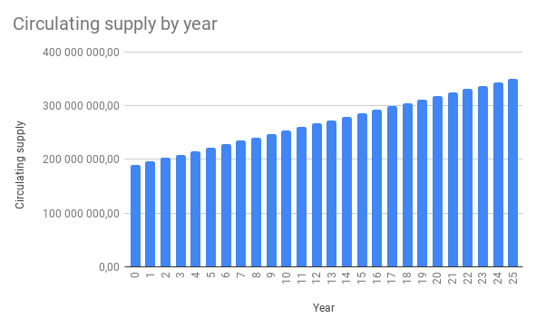
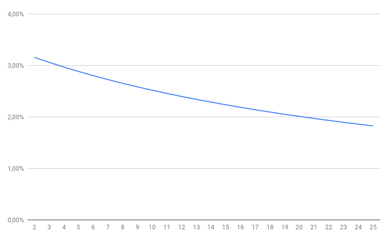

# ENQ 배출 모델

## 배출의 일반 원칙

시스템에 있는 모든 ENQ의 총량은 350,000,000.00 ENQ입니다.

총 ENQ 토큰 수 ([ERC-20](https://etherscan.io/token/0x16ea01acb4b0bca2000ee5473348b6937ee6f72f))는 126,880,563.75 ENQ였습니다.

ENQ 배출의 두 단계가 아래에 나와 있습니다.

### 1 단계. ENQ의 할당 (ERC-20)

1. 33,834,817 ENQ (ERC-20)는 ENQ 토큰 판매 조건에 따르는 ENQ 토큰 세일에 따라 판매할 수 있도록 예정되었습니다. Enecuum 적응형 분산 환경이 작동하면 ENQ (ERC-20)를 1:1 비율로 ENQ로 교환할 수 있습니다.
2. 25,376,112.75 ENQ (ERC-20)는 고문 및 파트너를 위해 예비되도록 예정되었습니다. Enecuum 적응형 분산 환경이 작동하면 ENQ (ERC-20)를 1:1 비율로 ENQ로 교환할 수 있습니다;
3. 16,917,408.50 ENQ (ERC-20)는 테스트넷 및 에어드랍 프로그램에서 보상으로 예비되도록 예정되었습니다. Enecuum 적응형 분산 환경이 작동하면 ENQ (ERC-20)를 1:1 비율로 ENQ로 교환할 수 있습니다;
4. 50,752,225.50 ENQ (ERC-20)는 시드 투자자를 위해 예비되도록 예정되었습니다. Enecuum 적응형 분산 환경이 작동하면 ENQ (ERC-20)를 1:1 비율로 ENQ로 교환할 수 있습니다.

### 2 단계. ENQ 배분 (메인넷 런칭 이후)

1. 17,500,000.00 ENQ는 메인 네트워크 출시 후 1년 동안 균일 잠금 해제를 통해 팀에 대한 보상으로 예비 될 예정입니다;
2. 45,500,000.00 ENQ는 메인 네트워크 출시 후 1년의 균일 잠금 해제 기간이 있는 예비 펀드로 예비 될 예정입니다;
3. 160,119,436.25 ENQ는 메인 네트워크 출시 후 25년 이내에 네트워크 참여자 (채굴자)에게 배포될 뿐만 아니라 채굴자 네트워크 개발 프로그램을 지원됩니다.

  

### 채굴 배출 모델

채굴 및 추천인 프로그램 보상에 사용할 수 있는 총 ENQ 수량은 160,119,436.25 ENQ입니다.

ENQ 데이터는 네트워크를 지원하고 블록체인 형성에 참여할 PoW, PoS 및 PoA 노드간에 메인 네트워크가 시작된 후 25년 이내에 배포됩니다. 블록은 15초마다 생성됩니다.

블록 생성 및 신규 코인 배출표는 다음과 같습니다.

|        |    블록의 수     | 배출, ENQ |
| ------ | ---------------- | ------------- |
|   분   | 4                | 12.19         |
|   일   | 5,760            | 17,547.34     |
|   년   | 2,102,400        | 6,404,777.45  |

### 블록 보상

총 블록 보상은 3.046 ENQ가 될 것이며, 이는 다음과 같이 네트워크 노드간에 분배될 것입니다.

|                        | PoW   | PoS    | PoA    |  추천인   |  총합   |
| ---------------------- | ----- | ------ | ------ | --------- | ------- |
| 보상, %                | 5.00% | 55.00% | 31.81% | 8.19%     | 100.00% |
|   보상, 블록 당 ENQ   | 0.152 | 1.676  | 0.969  | 0.250     | 3.046   |

시간에 따른 네트워크 노드 간의 보상 분배는 다음과 같습니다.

|                       | PoW          | PoS           | PoA           | 추천인      |
| --------------------- | ------------ | ------------- | ------------- | ------------- |
|     일일 보상, ENQ    | 877.37       | 9,651.03      | 5,581.19      | 1,437.75      |
|     연간 보상, ENQ    | 320,238.87   | 3,522,627.60  | 2,037,133.53  | 524,777.45    |
|   25 연간 보상, ENQ   | 8,005,971.81 | 88,065,689.94 | 50,928,338.25 | 13,119,436.25 |

### 인플레이션

25년 동안의 배출 모델과 연간 인플레이션이 아래에 나와 있습니다.

   

|  년  | 순환 수량 | 새로운 배출 | 인플레이션 |
|:---:|:--------------------------:|:-------------:|:--------:|
|  0  |       189 880 563,75       |       0       |    0%    |
|  1  |       196 285 341,20       |  6 404 777,45 |   3,26%  |
|  2  |       202 690 118,65       |  6 404 777,45 |   3,16%  |
|  3  |       209 094 896,10       |  6 404 777,45 |   3,06%  |
|  4  |       215 499 673,55       |  6 404 777,45 |   2,97%  |
|  5  |       221 904 451,00       |  6 404 777,45 |   2,89%  |
|  6  |       228 309 228,45       |  6 404 777,45 |   2,81%  |
|  7  |       234 714 005,90       |  6 404 777,45 |   2,73%  |
|  8  |       241 118 783,35       |  6 404 777,45 |   2,66%  |
|  9  |       247 523 560,80       |  6 404 777,45 |   2,59%  |
|  10 |       253 928 338,25       |  6 404 777,45 |   2,52%  |
|  11 |       260 333 115,70       |  6 404 777,45 |   2,46%  |
|  12 |       266 737 893,15       |  6 404 777,45 |   2,40%  |
|  13 |       273 142 670,60       |  6 404 777,45 |   2,34%  |
|  14 |       279 547 448,05       |  6 404 777,45 |   2,29%  |
|  15 |       285 952 225,50       |  6 404 777,45 |   2,24%  |
|  16 |       292 357 002,95       |  6 404 777,45 |   2,19%  |
|  17 |       298 761 780,40       |  6 404 777,45 |   2,14%  |
|  18 |       305 166 557,85       |  6 404 777,45 |   2,10%  |
|  19 |       311 571 335,30       |  6 404 777,45 |   2,06%  |
|  20 |       317 976 112,75       |  6 404 777,45 |   2,01%  |
|  21 |       324 380 890,20       |  6 404 777,45 |   1,97%  |
|  22 |       330 785 667,65       |  6 404 777,45 |   1,94%  |
|  23 |       337 190 445,10       |  6 404 777,45 |   1,90%  |
|  24 |       343 595 222,55       |  6 404 777,45 |   1,86%  |
|  25 |       350 000 000,00       |  6 404 777,45 |   1,83%  |

## 블록 생성 보상

### PoA 채굴

PoA (활동증명) 채굴은 안드로이드 모바일 장치 소유자가 사용할 수 있습니다.

PoA 채굴에 참여하려면 지속적인 인터넷 연결을 통해 실행중인 PoA 노드뿐만 아니라 25 - 25,000.00 ENQ의 활성 잔액이 필요합니다.

총 PoA 보상은 지분과 발행된 마이크로 블록 수에 따라 PoA 퍼블리셔에게 분배됩니다. 각 PoA 퍼블리셔는 현재 블록의 PoA 퍼블리셔 총 지분과 관련하여 지분에 비례하는 보상을 받습니다.

*poa_reward = block_reward * poa_stake / total_poa_stake*

ROI 계산기를 사용하여 예측 계산을 할 수 있습니다: [pulse.enecuum.com/#!/roi](https://pulse.enecuum.com/#!/roi)

메인 PoA 네트워크가 출시된 후 채굴자는 블록 생성에 대한 보상의 31.81%를 받게 되며, 이는 절대적으로 25년 동안 50,928,338.25 ENQ가 될 것입니다.

### PoS 채굴. 검증자 및 위임자

PoS 검증자가 되려면 사용자는 최소 잔액이 25,001.00 ENQ인 "상위 100" — 지분 가치가 가장 높은 PoS 계약의 등급 — 에 포함될만큼 충분히 높은 ENQ 잔액으로 PoS 계약을 생성해야 합니다. 그리고 블록체인 생성에 참여하려면 서버를 시작해야 합니다. PoS 서버는 인터넷에 지속적으로 연결되어야 합니다.

네트워크의 모든 구성원이 위임자가 될 수 있습니다. 이를 위해 적어도 1 ENQ가 검증자의 PoS 계약 주소로 전송되어야 합니다. 송금된 자금은 총 지분에 참여하고 ENQ에서 매일 보상을 받게 됩니다. 이 경우 위임자는 네트워크와 지속적으로 인터넷에 연결되어 있을 필요가 없습니다.

블록에 대한 보상은 검증자 자신의 지분과 위임자로부터 받은 지분에 비례하여 계산됩니다.

각 검증자는 위임자로부터 자동으로 청구되는 자기 보상에 대한 수수료를 지정합니다. 수수료는 0%에서 100%까지 가능합니다.

25년 동안 PoS 채굴자 (검증자 및 위임자)에 대한 총 보상은 88,065,689.94 ENQ가 될 것입니다. 이것은 시스템의 총 채굴 보상의 55%입니다.

검증자와 위임자는 트랜잭션 검증에도 참여하고 시스템에서 추가 보상을 받게 됩니다. 이 프로세스의 경제성은 다음에 설명되어 있습니다 [여기](#수수료-배분).

### PoW 채굴

PoW 노드의 작업은 필요한 복잡성을 가진 블록 해시를 얻기 위해 블록에 대한 *nonce* 값을 찾는 것으로 구성됩니다. RandomX 알고리즘은 해싱에 사용됩니다. PoW 노드를 시작하려면 인터넷에 연결된 서버가 필요합니다. 블록에 필요한 복잡성은 네트워크에서 작동하는 노드의 수에 따라 증가합니다.

25년 동안 PoW 채굴자에 대한 총 보상은 8,005,971.81 ENQ가 될 것입니다. 이것은 시스템 채굴에 대한 총 보상의 5%입니다.

## 트랜잭션 보상

Enecuum 메인 네트워크 런칭 이후 트랜잭션 수수료 지불이 도입될 예정입니다. 수수료 비용은 네이티브 코인과 프로토콜을 통해 발행된 토큰 모두에 대해 0.1 ENQ로 같습니다.

토큰 발행자는 발행된 토큰에서 사용자 수수료를 결정하는 반면 발행자는 Enecuum 채굴자 작업에 대한 지불을 위해 ENQ를 사용하는 것은 주목할 가치가 있습니다.

예시를 생각해보십시오.

Alice는 자신의 *Alice Token* 사용자 토큰을 출시했으며 사용자 수수료를 1AT로 정의했습니다. 즉, 모든 AT 전송마다 Alice는 지갑으로 1 AT를 받게 됩니다. 이 시점에서 0.1 ENQ의 수수료가 * Alice Token * 주소에서 자동으로 인출되어 채굴자들이 블록체인에 트랜잭션을 추가하는 작업에 대한 비용을 지불합니다.

### 수수료 배분

Enecuum 네트워크의 모든 거래에는 0.1 ENQ 수수료가 부과됩니다. 블록에 포함된 모든 거래에 대한 수수료는 이 블록을 생성한 네트워크 구성원 — PoS 리더 및 PoW, 활성 PoS 검증자 및 제네시스 계정 — 간에 합산되어 분배됩니다.

배분은 다음과 같습니다:

|  멤버  | 배분 |
|:-------------------------------:|:-----------:|
| PoS 리더 | 0.50% |
| PoW | 0.50% |
| 제네시스 | 3.00% |
| 모든 PoS (검증자 및 위임자) | 96.00% |
| 총합 | 100.00% |

PoS 검증자와 위임자 간의 분배는 채굴 블록에 대한 보상, 즉 지분 및 검증자 수수료에 비례하여 동일한 방식으로 발생합니다.