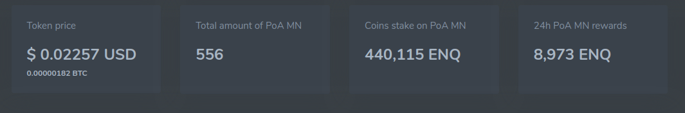

# How Does ROI Calculator Work

ROI (Return On Investment) is an indicator of return on investment, illustrating the level of profitability or loss, given the amount of investment made.

The ROI calculator is needed for users (miners) to receive up-to-date information about the amount of reward for a stake.

In the calculator, you can see the calculation of the yield of the stake, depending on its size. Stake in the Enecuum network has the minimum and maximum limits of its value.

When setting the size of the stake, watch the pop-up windows with recommendations not to violate the restrictions. In the calculator, there is always the most current information on the stake.

Calculations are made for 1 day, for 1 week, for 1 month, for 1 year for convenience of perception.

For example: if the value of your stake is 25 ENQ, then your possible return is as follows:

  

Daily ROI = 2.89% in this case, as in the picture above, means that you will earn 0.72 ENQ per stake per day in the amount of 25 ENQ. Alternatively, 25 ENQ multiplied by 2.89% equals 0.72 ENQ.

You can see the same calculations for a period of 1 week, 1 month, 1 year.

Information on the value of ROI is constantly updated depending on the change in the number of active miners and the value of the reward for miners in the Enecuum network:

  
