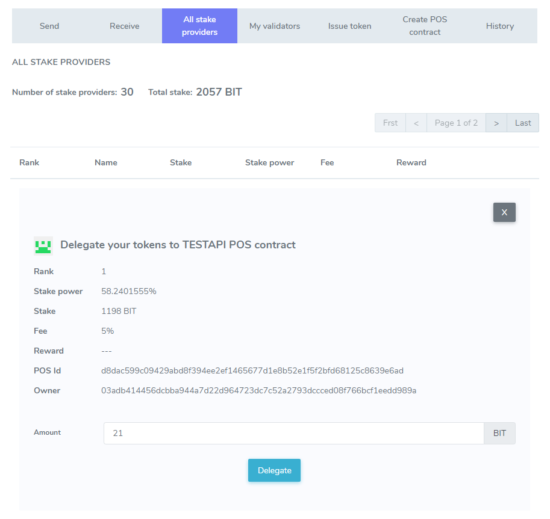
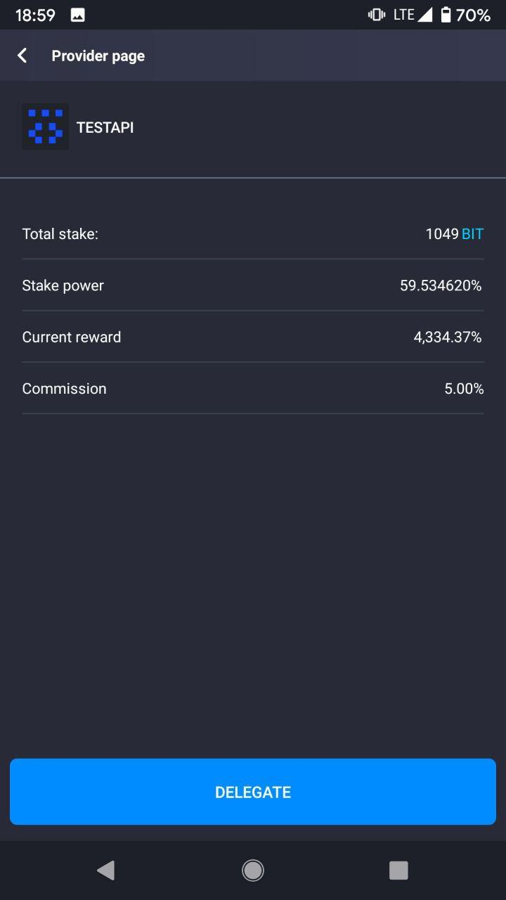
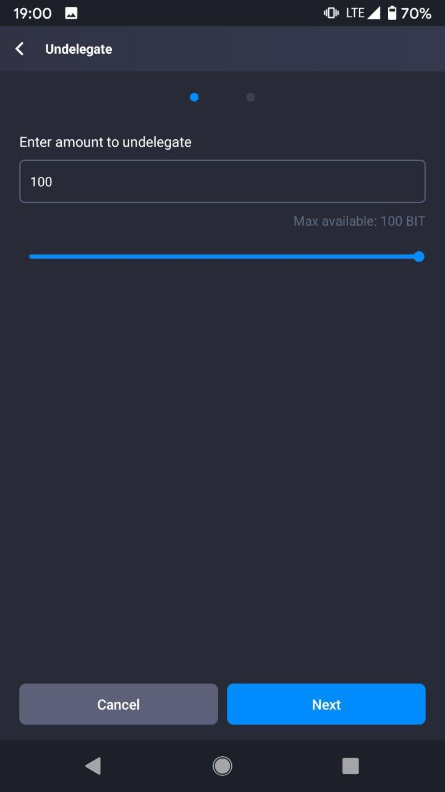
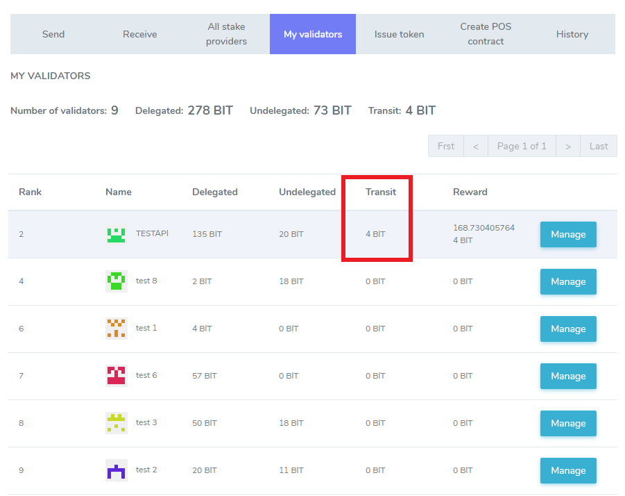
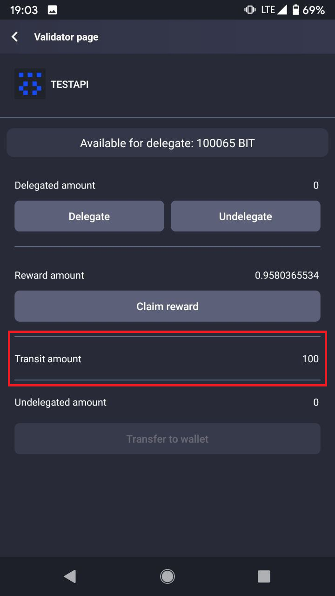
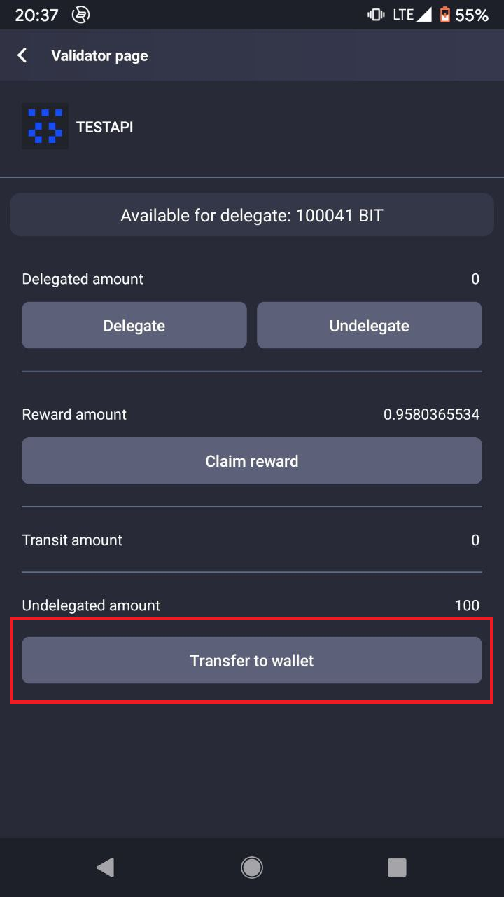
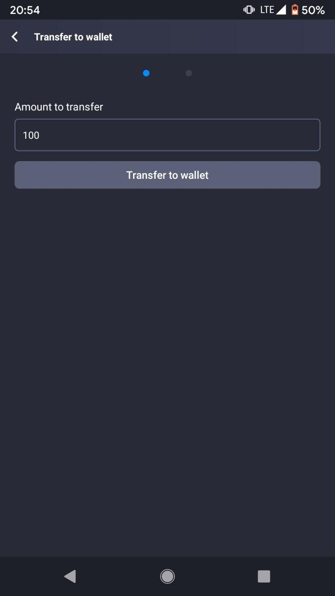
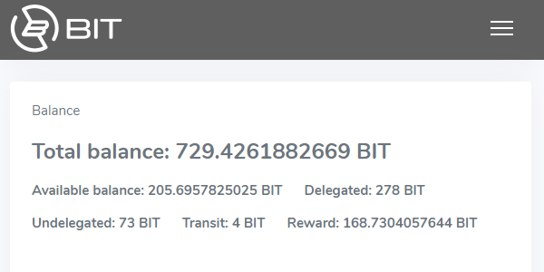

# How to Stake

With Enecuum, it is possible to use the Trinity protocol (a combination of PoA, PoS and PoW) as well as functionality such as ETM (Enecuum Token Machine), delegation to PoS nodes (delegated smart staking), issuing of different types of tokens - mining, NFT and other.

## Staking and PoS-contracts

General idea of staking is depositing (or "delegating" as we call it below) your funds to PoS-nodes to increase their stake power to remain in top 100 wallets (as only the richest wallets are allowed to perform PoS work) for a share from PoS mining rewards. To guarantee it, this share is calculated thoroughly, and in time, PoS contracts are introduced. These contracts control delegated funds in a way that they can be used only for PoS mining and a delegator can always return coins.

To receive additional returns from coins you hold you should delegate them to an active PoS contract. Active means that there is a PoS node (server) running and this PoS contract is in top 100 contracts by their stake power.

Think of it this way: when you create a PoS contact, you establish a bank. When you delegate your funds to a PoS contract, you open a bank deposit.

::: warning NOTICE
Only system native coins and only integer amount of the coins are available for delegating, undelegating and transfer. This is done by design of the system to achieve performance and scalability goals. So minimum 1 ENQ is possible to stake.
:::

## Staking via Web Wallet or App

You can manage you funds staked via mobile app or web interface. Let's start with web wallet. First of all, log in to your web wallet and make sure that you have not only funds to delegate but also to pay transaction fees.

### Delegate 

Choose PoS contract (stake provider) you want to delegate.  Main parameters to consider are PoS contract fee and PoS node uptime. To elaborate, the amount coins you should share with PoS owner is determined by the fee value and how often this PoS contract receives rewards for its delegators is shown by uptime number. At first release, we will only show PoS contract rewards history to estimate the uptime by eye. Detailed statistics will be added step by step.

  
 
  

After delegation, your total balance remains unchanged, but the delegated amount of coins moves from "available" to "delegated" balance. You can not use delegated funds as they work in PoS mining until you undelegate them. But this funds are still shown in your total balance as no one can use your funds either.

### Undelegate

"My validators" tab shows balances of delegated funds to PoS contracts. You can manage each PoS contract to receive reward or stop delegating. Choose the "undelegate" option to withdraw integer number of coins from "delegated" to "available" balance. 

  
 
  

::: warning NOTICE
Undelegation takes 2 transactions to be performed so you need to pay 2 standard transaction fees.
:::

### Transit

This is not an action but a state of your coins after the undelegation transaction. There is a time lock on your coins, which is the time needed for the coins to become available for the transfer to your balance, about 1.5 days. This time lock guarantees fair rewards calculation eliminating possibility to use one coin in two PoS contacts simultaneously. 

  

### Transfer

To finish undelegation procedure, you should transfer undelegated coins from a PoS contract to your "available" balance. You should make one transfer transaction for each undelegation transaction after the time lock passes.

  

  

### Claim Reward

Finally, you can claim your reward if it is available. Use "My validators" -> "Manage" -> "Claim reward" menu.

  
 
  

## Balances

The staking procedure introduces 5 different states of your funds, resulting in 5 types of balances.

-   Available: coins you can use freely. For instance, delegate, perform transaction or use to start mining.
-   Delegated: coins you moved to a certain PoS contract to receive rewards if the contract belongs to an active PoS.
-   Transit: coins you ordered to undelegate from a PoS contract with an active time lock. A time lock needs to pass for the coins to move to the "undelegated" state, 1.5 days.
-   Undelegated: coins that are no longer delegated. They are free to be transferred to the "available" balance with a "transfer" transaction.
-   Reward: earnings from funds delegation to a PoS contract. These rewards can be transferred explicitly to your balance. We plan to make this step automatic with Staking 2.0 features. 

    
  

	
  

	
  
