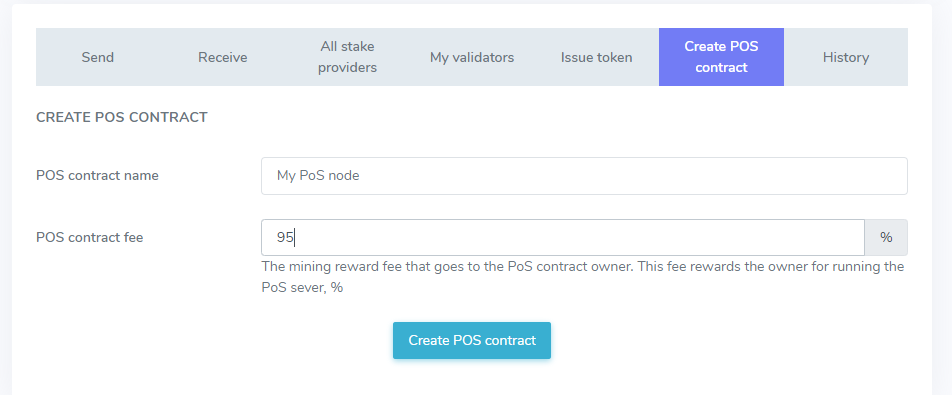

# Как запустить PoS

BIT - это тестовая сеть блокчейна Enecuum. С помощью BIT можно тестировать протокол Trinity (комбинация PoA, PoS и PoW), а также новые функции, такие как ETM (Enecuum Token Machine), делегирование на узлы PoS (делегированный смарт стейкинг), выпуск и тестирование различных типов токенов - для майнинга, NFT и др.

Сеть создана для публичного тестирования для членов сообщества Enecuum, партнеров и разработчиков децентрализованных приложений. Все новые функции, разработанные командой Enecuum, будут публично протестированы в сети BIT, а затем добавлены в основную сеть.

## Как пользоваться BIT

Перейдите на [bit.enecuum.com](https://bit.enecuum.com/), загрузите приложение для Android, создайте кошелек и сохраните свой секретный ключ. Вы также можете создать учетную запись со своего компьютера на [bit-wallet.enecuum.com/login](https://bit-wallet.enecuum.com/login). 

В сети BIT введены комиссии за транзакции, поэтому вам необходимо доплачивать 0,01 BIT за каждый «доступ на запись» в блокчейн, например, при создании PoS-контракта или получении вознаграждения за PoS-стейкинг. Чтобы оплатить комиссию, вы можете получить монеты BIT на [faucet-bit.enecuum.com](https://faucet-bit.enecuum.com/) (25 бит раз в 10 минут для одного адреса).

## Стейкинг и PoS-контракты

Общая идея стейкинга состоит в том, чтобы вносить (или «делегировать») ваши средства на PoS-узлы, чтобы увеличить их долю («stake power»), чтобы оставаться в топ-100 кошельков (поскольку только самые богатые кошельки могут выполнять работу PoS) для получения части наград от PoS-майнинга. Чтобы гарантировать это, эта часть награды рассчитывается полностью, и со временем вводятся PoS-контракты. Эти контракты контролируют делегированные средства таким образом, что их можно использовать только для PoS-майнинга, а делегатор всегда может вернуть монеты.

Поэтому, если вы хотите запустить PoS-узел, вы должны сначала создать PoS-контракт (сделать специальную транзакцию). Затем вы можете запустить узел - часть программного обеспечения, связанную с контрактом PoS.

Можете представить это так: когда вы создаете PoS-контакт, вы основываете банк. Когда вы делегируете свои средства на PoS-контракт, вы создаёте вклад в банке.

### Создание PoS-контракта

Для создания PoS-контракта используйте интерфейс [веб-кошелька](https://bit-wallet.enecuum.com/).

  

В интерфейсе два поля ввода: название PoS-контракта, которое можно оставить пустым, и комиссия за PoS-контракт. Комиссия за контракт определяет, какую «зарплату» получает владелец PoS за работу сервера. Тщательно выберите это значение, т.к. если оно будет установлено слишком маленьким, вы можете потерять деньги, платя за ваш сервер; но если вы установите его слишком высоким, никто не будет делегировать вам средства, и вы можете пропасть из списка топ-100 кошельков без какого-либо заработка. Этот процент комиссии будет изменяться в будущем, но в первом обновлении системы он не может быть изменен после создания.

После подтверждения транзакции PoS-контракта и оплаты комиссии за транзакцию, пожалуйста, подождите немного. Вы увидите новую запись в блокчейне. Пожалуйста, найдите ваш контракт на [странице PoS-контрактов в сети BIT](https://bit.enecuum.com/#!/pos-contracts). Если название PoS отсутствует, вы можете найти свой контракт по адресу владельца. Это должен быть кошелек, который вы использовали для отправки транзакции создания контракта PoS.

  

Нажмите на хэш вашего контракта и скопируйте его. В случае на изображении выше, хэшем является последовательность 17d0b43aafb141dbc4e36ae0abefc2b28b3979f96a84cdecf7e26dc25bd1c042, которая обозначена красным цветом. Этот хэш будет использован в следующем шаге.

### Делегирование PoS-контракту

В следующих обновлениях появится минимальный стейк для самоделегирования. Но на данный момент делегировать собственные средства на свой контракт необязательно. Итак, **вы можете пропустить этот шаг.** Просто создайте контракт PoS и запустите узел. Но если вы хотите увеличить ваши вознаграждения, вы можете делегировать свой собственный PoS-контракт так же, как и любой другой.

Чтобы узнать, как делегировать свои средства, обратитесь к [соответствующему руководству.](how-to-delegate.md)

### Запуск PoS-узла

Следуйте [разделу PoS](how-to-mine-bit.html#как-запустить-pos) руководства "Как майнить BIT". Используйте хэш из предыдущего шага в качестве параметра POS_ID.

### Просмотр делегатов и наград

  

  

На странице контракта PoS вы можете найти количество делегированных монет и вознаграждений, которые получает ваш контракт. Обратите внимание, что вознаграждения, показанные в Blockchain Explorer, распределяются между владельцем PoS и его делегатами в соответствии с вашей комиссией  контракта.