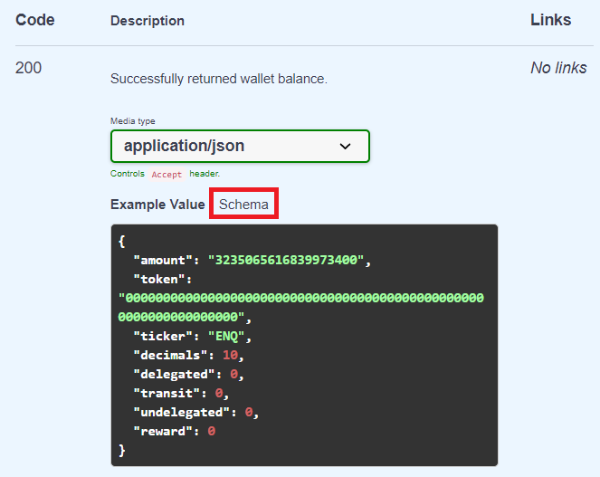

# API/Интеграция

## [API](https://app.swaggerhub.com/apis-docs/enecuum/EnecuumNodeAPI/1.0.0)

API Enecuum доступен на [Swagger.](https://app.swaggerhub.com/apis-docs/enecuum/EnecuumNodeAPI/1.0.0)

Инструкцию по созданию кошелька в Enecuum можно найти во введении. Инструкции по отправке транзакций и генерации подписей доступны в методе POST /tx.

::: danger ОСТОРОЖНО
ENQ имеет хэш токена/идентификатор/тикер транзакции **0000000000000000000000000000000000000000000000000000000000000000**. Ненулевые значения означают, что вы имеете дело с активом, отличным от Enecuum. Пользовательские токены имеют случайную шестнадцатеричную строку в качестве идентификатора токена.
:::

::: danger ОСТОРОЖНО
Отклоненные транзакции записываются в блокчейн. Используйте GET /tx, чтобы проверить статус транзакции.
:::

Имейте в виду, что любой кошелек, в том числе созданный для технических целей, может получать реферальные вознаграждения. Это может произойти, если кто-то решит использовать реферальный адрес кошелька в качестве своего реферального агента. Эти награды стмечены в блокчейне соответствующим образом.

Чтобы получить объяснение ответов на запросы, перейдите к схемам ответов. Вы можете получить к ним доступ, выбрав «Schema» рядом с «Example Value».

  

## Интеграция пользовательских токенов

В некоторых методах API необходимо указывать идентификатор токена. Для ENQ идентификатор токена - это нули. Если идентификатор токена представляет собой случайную шестнадцатеричную строку, это означает, что это пользовательский токен.

Чтобы отправлять транзакции с пользовательскими токенами, используйте POST /tx с указанным идентификатором токена.

Для проверки баланса используйте метод GET /balance с указанным идентификатором токена.

Чтобы узнать комиссию за пользовательский токен, эмиссию и другие параметры, используйте GET /token_info с указанным идентификатором токена. Комиссии за пользовательские токены описаны в руководстве [Принцип работы комиссии](token-issue.md#принцип-работы-комиссии).