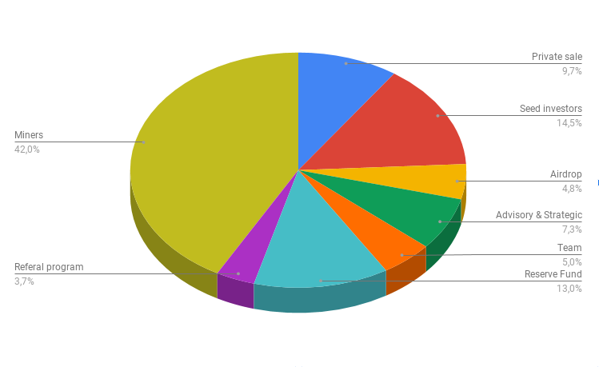
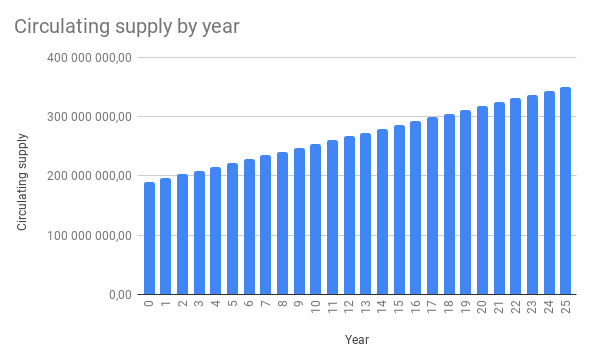
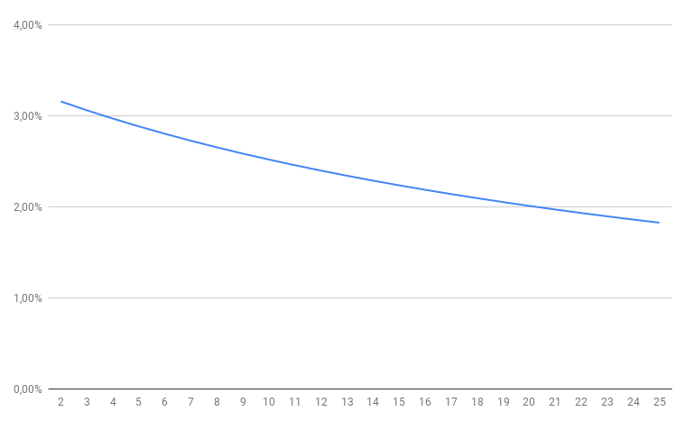

# Модель эмиссии ENQ

## Общие принципы эмиссии

Общий объем всех ENQ в системе составит 350,000,000.00 ENQ. 

Общее количество токенов ENQ ([ERC-20](https://etherscan.io/token/0x16ea01acb4b0bca2000ee5473348b6937ee6f72f)) составило 126,880,563.75 ENQ.

Два этапа выпуска ENQ предназначены для следующего.

### Этап 1. Распределение ENQ (ERC-20) 

1. Предполагается, что 33,834,817 ENQ (ERC-20) будут доступны для продажи в рамках продажи токенов ENQ, что будет регулироваться условиями продажи токенов ENQ. Предполагается, что станет возможным обмен ENQ (ERC-20) на ENQ по курсу 1:1, когда адаптивная децентрализованная среда Enecuum будет введена в эксплуатацию;
2. 25,376,112.75 ENQ (ERC-20) предлагается зарезервировать для консультантов и партнеров. Предполагается, что станет возможным обмен ENQ (ERC-20) на ENQ по курсу 1:1, когда адаптивная децентрализованная среда Enecuum будет введена в эксплуатацию;
3. 16,917,408.50 ENQ (ERC-20) предлагается зарезервировать в качестве вознаграждения за работу в тестовой сети и программы Airdrop. Предполагается, что станет возможным обмен ENQ (ERC-20) на ENQ по курсу 1:1, когда адаптивная децентрализованная среда Enecuum будет введена в эксплуатацию;
4. 50,752,225.50 ENQ (ERC-20) предлагается зарезервировать seed инвесторам. Предполагается, что станет возможным обмен ENQ (ERC-20) на ENQ по курсу 1:1, когда адаптивная децентрализованная среда Enecuum будет введена в эксплуатацию.

### Этап 2. Распределение ENQ (после запуска основной сети)

1. 17,500,00.00 ENQ предлагается зарезервировать как вознаграждение команде с периодом равномерной разблокировки в течение 1 года после запуска основной сети;
2. 45,500,000.00 ENQ предлагается зарезервировать в качестве резервного фонда с периодом равномерной разблокировки в течение 1 года после запуска основной сети;
3. 160,119,436.25 ENQ будут распределены среди участников сети (майнеров) в течение 25 лет после запуска основной сети, а также в качестве поддержки программы развития сети майнеров.

  

### Модель эмиссии при майнинге

Общее количество ENQ, доступное для майнинга и вознаграждения по реферальной программе, составит 160,119,436.25 ENQ.

Данные ENQ будут распределены в течение 25 лет с момента запуска основной сети среди узлов PoW, PoS и PoA, которые будут поддерживать работу сети и участвовать в формировании цепочки блоков. Блоки будут создаваться каждые 15 секунд.

Таблица генерации блоков и эмиссии новых монет представлена ниже.

|        | Количество блоков | Эмиссия, ENQ |
|--------|:-----------------:|:------------:|
| Минута |         4         |     12.19    |
|  День  |       5,760       |   17,547.34  |
|   Год  |     2,102,400     | 6,404,777.45 |

### Награда за блок

Общее вознаграждение за блок составит 3.046 ENQ, которое будет распределяться между узлами сети следующим образом.

|              |  PoW  |   PoS  |   PoA  | Рефералы |  Всего  |
|--------------|:-----:|:------:|:------:|:--------:|:-------:|
|  Награда, %  | 5.00% | 55.00% | 31.81% |   8.19%  | 100.00% |
| Награда, ENQ | 0.152 |  1.676 |  0.969 |   0.250  |  3.046  |

Распределение вознаграждения между узлами сети во времени представлено ниже.

|                        |      PoW     |      PoS      |      PoA      |    Рефералы   |
|------------------------|:------------:|:-------------:|:-------------:|:-------------:|
|  Награда за день, ENQ  |    877.37    |    9,651.03   |    5,581.19   |    1,437.75   |
|   Награда за год, ENQ  |  320,238.87  |  3,522,627.60 |  2,037,133.53 |   524,777.45  |
| Награда за 25 лет, ENQ | 8,005,971.81 | 88,065,689.94 | 50,928,338.25 | 13,119,436.25 |

### Инфляция

Ниже приведена модель эмиссии и годовая инфляция на 25 лет.

   

| Год | Циркулирующее предложение | Новая эмиссия | Инфляция |
|:---:|:--------------------------:|:-------------:|:--------:|
|  0  |       189 880 563,75       |       0       |    0%    |
|  1  |       196 285 341,20       |  6 404 777,45 |   3,26%  |
|  2  |       202 690 118,65       |  6 404 777,45 |   3,16%  |
|  3  |       209 094 896,10       |  6 404 777,45 |   3,06%  |
|  4  |       215 499 673,55       |  6 404 777,45 |   2,97%  |
|  5  |       221 904 451,00       |  6 404 777,45 |   2,89%  |
|  6  |       228 309 228,45       |  6 404 777,45 |   2,81%  |
|  7  |       234 714 005,90       |  6 404 777,45 |   2,73%  |
|  8  |       241 118 783,35       |  6 404 777,45 |   2,66%  |
|  9  |       247 523 560,80       |  6 404 777,45 |   2,59%  |
|  10 |       253 928 338,25       |  6 404 777,45 |   2,52%  |
|  11 |       260 333 115,70       |  6 404 777,45 |   2,46%  |
|  12 |       266 737 893,15       |  6 404 777,45 |   2,40%  |
|  13 |       273 142 670,60       |  6 404 777,45 |   2,34%  |
|  14 |       279 547 448,05       |  6 404 777,45 |   2,29%  |
|  15 |       285 952 225,50       |  6 404 777,45 |   2,24%  |
|  16 |       292 357 002,95       |  6 404 777,45 |   2,19%  |
|  17 |       298 761 780,40       |  6 404 777,45 |   2,14%  |
|  18 |       305 166 557,85       |  6 404 777,45 |   2,10%  |
|  19 |       311 571 335,30       |  6 404 777,45 |   2,06%  |
|  20 |       317 976 112,75       |  6 404 777,45 |   2,01%  |
|  21 |       324 380 890,20       |  6 404 777,45 |   1,97%  |
|  22 |       330 785 667,65       |  6 404 777,45 |   1,94%  |
|  23 |       337 190 445,10       |  6 404 777,45 |   1,90%  |
|  24 |       343 595 222,55       |  6 404 777,45 |   1,86%  |
|  25 |       350 000 000,00       |  6 404 777,45 |   1,83%  |

## Награда за создание блока

### PoA-майнинг

PoA (Proof-of-Activity) майнинг доступен для владельцев мобильных телефонов на платформе Android.

Для участия в PoA-майнинге необходимо иметь активный баланс от 25 до 25,000.00 ENQ и действующий PoA узел, который должен иметь бесперебойное подключение к сети интернет. 

Общее вознаграждение PoA распределяется между публикаторами PoA в соответствии с их стейками и количеством выпущенных микроблоков. Каждый PoA публикатор получает вознаграждение, пропорциональное его стейку по отношению к общему стейку PoA-публикаторов текущего блока.

*poa_reward = block_reward * poa_stake / total_poa_stake*

Предварительный расчет можно сделать с помощью ROI калькулятора: [neuro.enecuum.com/#!/roi](https://neuro.enecuum.com/#!/roi)

После запуска основной сети PoA майнеры получат 31.81% от вознаграждения за формирование блоков, что в абсолютном значении составит 50,928,338.25 ENQ в течение 25 лет.

### PoS-майнинг. Валидаторы и делегаторы

Для того чтобы стать PoS-валидатором, необходимо создать PoS контракт с балансом ENQ, входящем в "топ 100" — рейтинг PoS-контрактов с наибольшим значением стейка — но не менее 25,001.00 ENQ. Также необходимо запустить сервер для участия в создании цепочки блоков, который должен иметь бесперебойное подключение к сети Интернет.

Любой из участников сети может стать делегатором. Для этого необходимо отправить на адрес PoS-контракта валидатора не менее 1 ENQ. Отправленные средства будут участвовать в общем стейке и получать ежедневное вознаграждение в ENQ. При этом делегатору нет необходимости находиться в постоянном подключении к сети Интернет.

Вознаграждения за блок начисляются пропорционально собственному стейку валидатора и стейкам, которые валидатор получил от делегаторов.

Каждый валидатор назначает комиссию собственного вознаграждения, которая взимается автоматически с делегаторов. Комиссия может быть от 0% до 100%.

Общее вознаграждение для PoS майнеров (валидаторов и делегаторов) в течение 25 лет составит 88,065,689.94 ENQ. Это 55% от общего вознаграждения за майнинг в системе.

Валидаторы и делегаторы также будут участвовать в верификации транзакций и будут получать дополнительное вознаграждение от системы. Экономика этого процесса описана [здесь](#%D1%80%D0%B0%D1%81%D0%BF%D1%80%D0%B5%D0%B4%D0%B5n%D0%B5%D0%BD%D0%B8%D0%B5-%D0%BA%D0%BE%D0%BC%D0%B8%D1%81%D1%81%D0%B8%D0%B8).

### PoW-майнинг

Работа PoW узлов состоит в подборе nonce блока для получения хеша, обладающего требуемой сложностью. В качестве хеш-функции используется алгоритм RandomX. Для запуска PoW узла требуется подключенный к интернету сервер. Требуемая сложность блока растёт с количеством работающих в сети узлов.

Общее вознаграждение для PoW майнеров в течение 25 лет составит 8,005,971.81 ENQ. Это 5% от общего вознаграждения за майнинг в системе.

## Награда за транзакции

После запуска основной сети Enecuum будет введена оплата комиссии за транзакции. Стоимость комиссии будет равна 0.1 ENQ как для нативной монеты, так и для токенов, выпущенных на протоколе.

Здесь стоит отметить, что эмитенты монет на протоколе сами определяют пользовательские комиссии в выпущенной монете, при этом с майнерами сети Enecuum эмитент использует ENQ в качестве оплаты за работу.

Рассмотрим на примере. 

Alice выпустила свой пользовательский токен Alice Token и определила пользовательскую комиссию в 1 AT. Это значит, что при каждой пересылке AT Alice будет получать на свой кошелек 1 AT. В этот момент автоматически произойдет списание с адреса AT комиссии за проведение этой транзакции в размере 0.1 ENQ.

### Распределение комиссии

За все транзакции в сети Enecuum взимается комиссия в размере 0.1 ENQ. Комиссии за все транзакции, вошедшие в блок, суммируются и распределяются между участниками сети, выпустившими этот блок — PoW и PoS-лидером, а также между активными валидаторами PoS и genesis-аккаунтом в соответствии с таблицей. 

На примере относительных значений распределение будет проходить следующим образом: 

|             Участник              | Распределение |
| :-------------------------------: | :-----------: |
|             PoS-лидер             |     0.50%     |
|                PoW                |     0.50%     |
|              Genesis              |     3.00%     |
| Все PoS (валидаторы и делегаторы) |    96.00%     |
|               Всего               |    100.00%    |

Распределение между PoS валидаторами и делегаторами будет происходить так же, как и за награду за майнинг блоков — пропорционально стейку и комиссии валидатора.