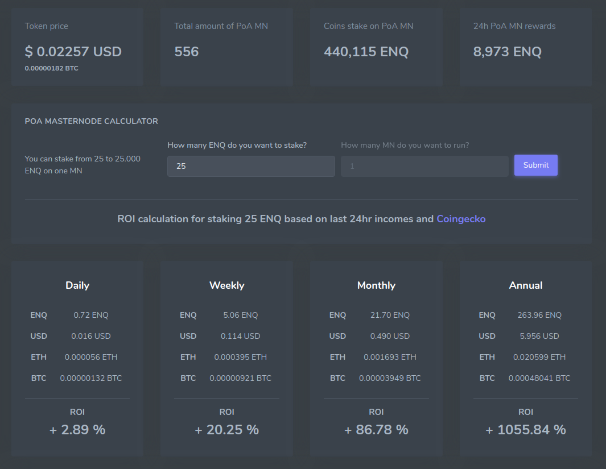

# Как работает "Калькулятор доходности"

ROI (Окупаемость инвестиций) - это показатель рентабельности инвестиций, наглядно показывающий уровень прибыльности или убыточности, учитывая объем произведенных инвестиций.

Калькулятор ROI необходим пользователям (майнерам) для получения актуальной информации о размере вознаграждения за стейк.

В калькуляторе можно посмотреть расчет доходности Вашего стейка в зависимости от ее размера. стейк в Сети Enecuum имеет минимальный и максимальный пределы ее значения.

При установке размера стейка следите за всплывающими окнами с рекомендациями не нарушать ограничения. В калькуляторе всегда есть самая актуальная информация о стейке.

Расчеты производятся на 1 сутки, 1 неделю, 1 месяц и 1 год для удобства восприятия.

Например: если значение вашего стейка составляет 25 ENQ, то ваш возможный доход выглядит следующим образом:

  

Суточный ROI, как и на картинке выше, в этом случае равен 2.89%. Это означает, что за Ваш стейк в размере 25 ENQ вы будете зарабатывать 0.72 enq в сутки. Другими словами, 25 ENQ умноженное на 2,89% равняется 0,72 ENQ.

Вы можете посмотреть расчеты также на период 1 недели, 1 месяца и 1 года соответственно.

Информация о величине ROI постоянно обновляется и зависит от количества активных майнеров и величины вознаграждения для них же в Сети Enecuum:

  
