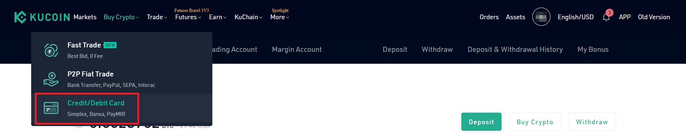
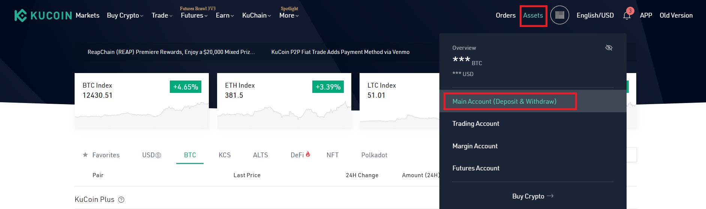
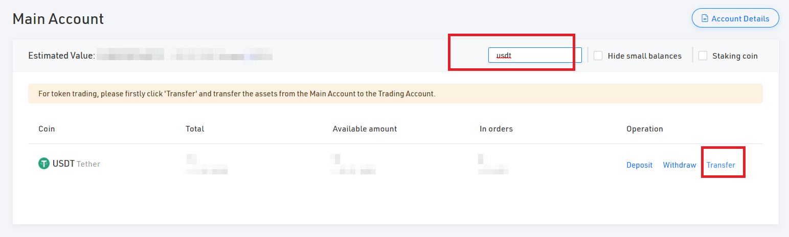
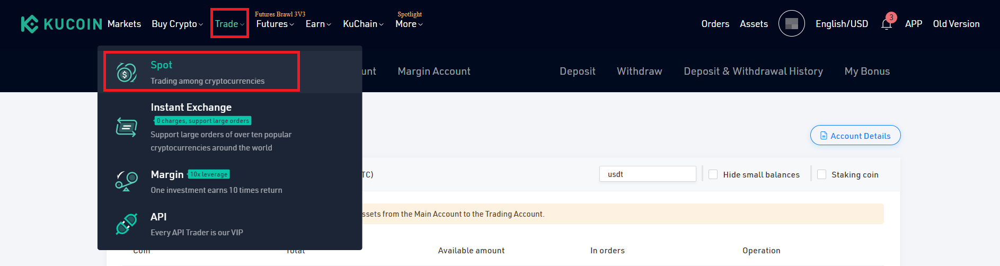
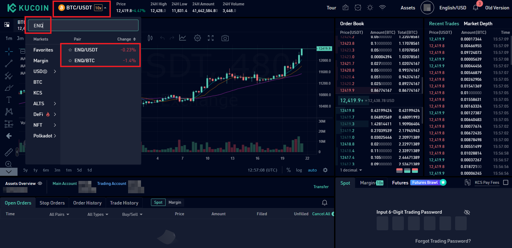

# Как купить ENQ на бирже

## Buy ENQ

::: tip СОВЕТ
ENQ доступен на [нескольких биржах](https://enecuum.com/buy). Это руководство объясняет покупку на бирже KuCoin.

You need cryptocurrency to buy ENQ. If you already have BTC or USDT, skip to step 3. If you have other crypto, e.g. ETH, you can exchange it to BTC or USDT in the same way as in steps 3-4, and then exchange BTC or USDT to ENQ.
:::

1. Log in or create an account on [KuCoin.](https://www.kucoin.com/) 
2. You can buy ENQ with other cryptocurrencies based on the available trading pairs. For KuCoin exchange, BTC and USDT are available. If you buy crypto with a credit card, USDT may arrive faster and with lower fee, but please do your own research. Skip to step 3 if you already have crypto.

	a. Select Buy Crypto -> Credit/Debit Card.
	
	
  

	   
	b. Fill in the form and confirm. Follow the instructions provided by the exchange.
	
	
  

	   
3. Transfer the crypto from your main account to the trading account.

	a. Go to Assets -> Main account.
	
	
  

	   
	b. Search for USDT or BTC. Click "Transfer".
	
	
  

	   
	c. Fill in the form and confirm.
	
	
  

	   
4. Exchange BTC or USDT to ENQ.

	a. Go to Trade -> Spot.
	
	
  

	   
	b. Select the trading pair in the top-left corner of the page. Search for ENQ. Choose your desired pair.
	
	
  

	   
	c. Navigate to the bottom-right corner of the page. Find "Spot". Fill in your trading password. 
	
	
  

	   
	d. Look at the available orders. You can click on the order to quickly buy ENQ, or you can place your own order at the desired price. Click "Buy ENQ" when you are ready.
	
	
  

	   
5. Transfer ENQ to your main account.

	a. Go to Assets -> Trading account.
	
	
  

	   
	b. Search for ENQ. Click "Transfer".
	
	
  

	   
	c. Fill in the form and confirm.
	
	
  

	   
6. Withdraw ENQ.

	a. Go to Main account.
	
	
  

	   
	b. Search for ENQ. Click "Withdraw".
	
	
  

	   
	c. Fill in the form. Use your ENQ public key.
	   
7. ENQ should appear in your Enecuum wallet. You can check your balance by searching for your public key in [Blockchain Explorer](http://pulse.enecuum.com/), logging in to [web wallet](https://wallet.enecuum.com/) or downloading [Enecuum App](http://app.enecuum.com/).

## Deposit ENQ

1. On KuCoin, go to Main account.

  

2. Search for ENQ. Click "Deposit".

  

3. Copy the deposit address.

  

4. Transfer ENQ from your Enecuum wallet to the copied address. You can do that via [web wallet](https://wallet.enecuum.com/) or [via Enecuum app](http://app.enecuum.com/).

  

  

5. ENQ should appear in your KuCoin account.