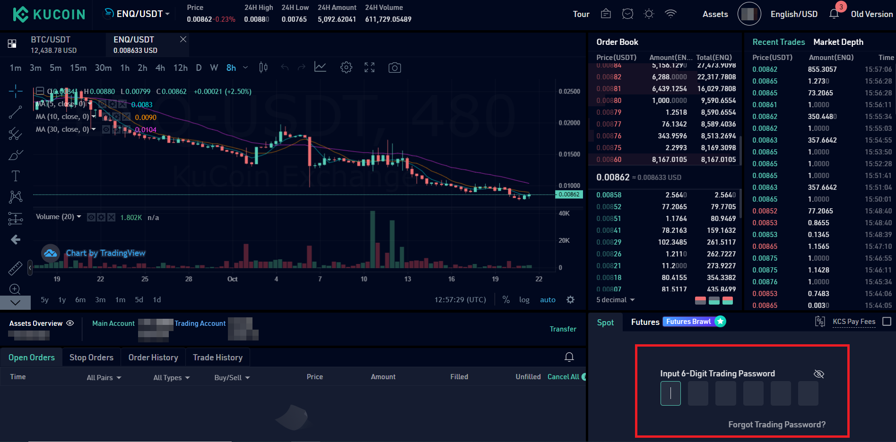
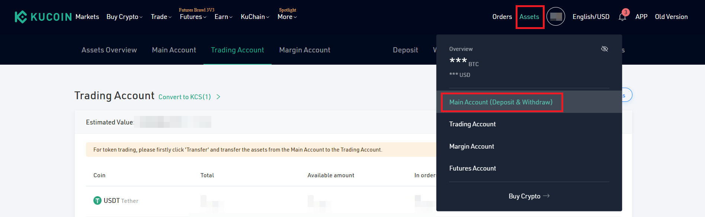
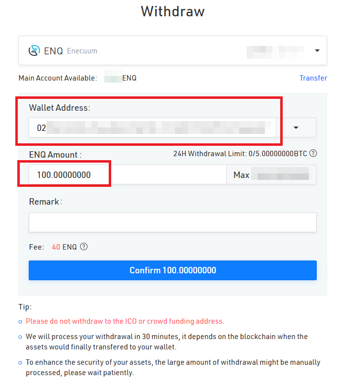

# Как купить ENQ на бирже

## Купить ENQ

::: tip СОВЕТ
ENQ доступен на [нескольких биржах](https://enecuum.com/buy). Это руководство объясняет покупку на бирже KuCoin.

Для покупки ENQ необходима криптовалюта. Если у вас уже есть BTC или USDT, вы можете пропустить шаг 2. Если у вас есть другая криптовалюта, например ETH, вы можете обменять её на BTC или USDT аналогично шагам 3-4, а затем обменять BTC или USDT на ENQ.
:::

1. Войдите или создайте учетную запись на [KuCoin.](https://www.kucoin.com/) 
2. Вы можете купить ENQ за другую криптовалюту в зависимости от доступных торговых пар. Для KuCoin доступны BTC и USDT. Если вы покупаете криптовалюту с помощью банковской карты,  то получение USDT может пройти быстрее и с более низкой комиссией, но, пожалуйста, исследуйте эту информацию в дополнительных источниках. Если у вас уже есть криптовалюта, перейдите к шагу 3.

	a. Выберите Купить криптовалюту -> Кредитная/дебетовая карта.
	
	
  

	   
	b. Заполните форму и подтвердите. Следуйте инструкциям биржи.
	
	
  

	   
3. Переведите криптовалюту с основного аккаунта на торговый аккаунт.

	a. Выберите Активы -> Основной аккаунт.
	
	
  

	   
	b. Найдите USDT или BTC. Нажмите «Перевести».
	
	
  

	   
	c. Заполните форму и подтвердите.
	
	
  

	   
4. Обменяйте BTC или USDT на ENQ.

	a. Выберите Торговля -> Спотовый.
	
	
  

	   
	b. Выберите торговую пару в верхнем левом углу страницы. Найдите ENQ. Выберите желаемую пару.
	
	
  

	   
	c. Перейдите в правый нижний угол страницы. Найдите «Спот». Введите свой торговый пароль.
	
	
  

	   
	d. Исследуйте доступные ордеры. Вы можете нажать на ордер, чтобы быстро купить ENQ, или вы можете разместить свой ордер по желаемой цене. Когда будете готовы, нажмите «Купить ENQ».
	
	
  

	   
5. Переведите ENQ на основной аккаунта.

	a. Перейдите в Активы -> Торговый аккаунт.
	
	
  

	   
	b. Найдите ENQ. Нажмите «Перевести».
	
	
  

	   
	c. Заполните форму и подтвердите.
	
	
  

	   
6. Выведите ENQ.

	a. Перейдите в основной аккаунт.
	
	
  

	   
	b. Найдите ENQ. Нажмите «Вывод».
	
	
  

	   
	c. Заполните форму. Используйте свой открытый ключ (адрес) ENQ. Обратите внимание на комиссию за вывод средств.
	
	
  

	   
7. ENQ должен появиться в вашем кошельке Enecuum. Вы можете проверить свой баланс, выполнив поиск своего открытого ключа в [Blockchain Explorer](https://pulse.enecuum.com/), войдя в [веб-кошелёк](https://wallet.enecuum.com/) или загрузив [приложение Enecuum](https://app.enecuum.com/).

## Депозит ENQ

1. Перейдите в основной аккаунт KuCoin.

  

2. Найдите ENQ. Нажмите «Депозит».

  

3. Скопируйте адрес для депозита.

  

4. Переведите ENQ со своего кошелька Enecuum на скопированный адрес. Вы можете сделать это через [веб-кошелёк](https://wallet.enecuum.com/) или [приложение Enecuum](https://app.enecuum.com/).

  

  

5. ENQ должен появиться в вашем аккаунте KuCoin.