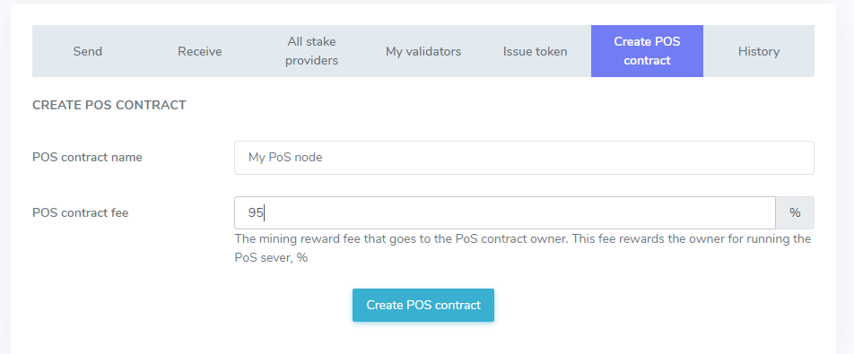

# Как запустить PoS узел

Вместе с Enecuum вы можете использовать протокол Trinity (комбинацию PoA, PoS и PoW узлов) наряду с ETM (Enecuum Token Machine), делегировать средства на PoS узлы (смарт стейкинг), выпускать различные виды токенов – майнинговые, с нефиксированной эмиссией и другие.

## Стейкинг и PoS-контракты

Общая идея стейкинга состоит в том, чтобы вносить (или «делегировать») ваши средства на PoS-узлы, чтобы увеличить их долю («stake power»), чтобы оставаться в топ-100 кошельков (поскольку только самые богатые кошельки могут выполнять работу PoS) для получения части наград от PoS-майнинга. Чтобы гарантировать это, эта часть награды рассчитывается полностью, и со временем вводятся PoS-контракты. Эти контракты контролируют делегированные средства таким образом, что их можно использовать только для PoS-майнинга, а делегатор всегда может вернуть монеты.

Поэтому, если вы хотите запустить PoS-узел, вы должны сначала создать PoS-контракт (сделать специальную транзакцию). Затем вы можете запустить узел - часть программного обеспечения, связанную с контрактом PoS.

Можете представить это так: когда вы создаете PoS-контакт, вы основываете банк. Когда вы делегируете свои средства на PoS-контракт, вы создаёте вклад в банке.

### Создание PoS-контракта

Для создания PoS-контракта используйте интерфейс [веб-кошелька](https://wallet.enecuum.com/).

<p align = "center">  </p>

В интерфейсе два поля ввода: название PoS-контракта, которое можно оставить пустым, и комиссия PoS-валидатора. Комиссия за контракт определяет, какую «зарплату» получает владелец PoS за работу сервера. Тщательно выберите это значение, т.к. если оно будет установлено слишком маленьким, вы можете потерять деньги, платя за ваш сервер; но если вы установите его слишком высоким, никто не будет делегировать вам средства, и вы можете пропасть из списка топ-100 кошельков без какого-либо заработка. Этот процент комиссии будет изменяться в будущем, но в первом обновлении системы он не может быть изменен после создания.

После подтверждения транзакции PoS-контракта и оплаты комиссии за транзакцию (500.1 ENQ), пожалуйста, подождите немного. Вы увидите новую запись в блокчейне. Пожалуйста, найдите ваш контракт на [странице PoS-контрактов](https://pulse.enecuum.com/#!/pos-contracts). Если название PoS отсутствует, вы можете найти свой контракт по адресу владельца. Это должен быть кошелек, который вы использовали для отправки транзакции создания контракта PoS.

<p align = "center">  </p>

Нажмите на хэш вашего контракта и скопируйте его. В случае изображения выше, хэшем является последовательность 17d0b43aafb141dbc4e36ae0abefc2b28b3979f96a84cdecf7e26dc25bd1c042, которая обозначена красным цветом. Этот хэш будет использован в следующем шаге.

Чтобы ваш PoS-контракт стал активным, необходимо выполнить 3 условия:

- на счету PoS-контракта должно быть 25001 ENQ, делегированных с того же кошелька, с которого создавался PoS-контракт;
- PoS-контракт должен входить в топ-100 самых богатых контрактов;
- должен быть запущен узел PoS с указанием id вашего PoS-контракта

### Делегирование PoS-контракту

Минимальный стейк для самоделегирования составляет 25001 ENQ. Если вы хотите увеличить ваши вознаграждения, вы можете делегировать свой собственный PoS-контракт так же, как и любой другой.

Чтобы узнать, как делегировать свои средства, обратитесь к [соответствующему руководству.](how-to-delegate.md)

## Запуск PoS-узла

### Предварительные требования

::: tip ВНИМАНИЕ
PoW и Fullnode могут работать только с **публичными (белыми) IP-адресами**. IP-адрес может быть как статическим, так и динамическим.
:::

::: tip ВНИМАНИЕ
Минимальные системные требования составляют **1** **ядро** CPU, **2 ГБ** оперативной памяти, **20 ГБ** дискового пространства. Подобным требованиям соответствуют небольшие VPS серверы, предлагаемые большинством хостинг-провайдеров. Требования к диску будут расти с ростом блокчейна и оцениваются в **1 ТБ** через 1-2 года. Пожалуйста отметьте, что удовлетворение минимальных требований может не обеспечить максимальную производительность (и максимальное возможно вознаграждение) вашего узла PoS. Рекомендуемые требования будут опубликованы после ряда запланированных оптимизаций программного обеспечения узла PoS.
:::

::: danger ПРЕДУПРЕЖДЕНИЕ
В текущей версии узлы стабильно работают только под управлением ОС Linux. На OC Windows и Mac возникают проблемы с сетью.
:::

- Компоненты сети развёртываются через *Docker* -- платформу, предназначенную для создания, совместного использования и запуска приложений с контейнерами. Поэтому в первую очередь [скачайте Docker](https://www.docker.com/) для вашей ОС, следуя официальным руководствам. Для пользователей Windows мы рекомендуем [Docker Toolbox](https://github.com/docker/toolbox/releases). Пользователи Linux могут воспользоваться [руководством Docker для Ubuntu.](https://docs.docker.com/install/linux/docker-ce/ubuntu/)

- После установки Docker скачайте базу данных, которая будет использоваться в Fullnode, PoW или PoS. **Это обязательный шаг**.

  ```
  docker run -d --name pulse_db -e MYSQL_ROOT_PASSWORD=<ваш_пароль_к_базе> enecuum/pulse_db
  ```
- Работать с Docker просто. Вам будет достаточно следующих команд:
	- остановить контейнер: `docker stop <имя-контейнера>`; 
	- показать остановленные контейнеры: `docker ps -a`;
	- запустить контейнер: `docker start <имя-контейнера>`;
	- показать активные контейнеры: `docker ps`.
	- показать логи: `docker logs <container-name>`;
	- показать использование диска: `docker system df -v`.


При остановке и перезапуске контейнера скачанные данные не будут утеряны.

### Как запустить PoS

1. Внимательно прочитайте [предварительные требования](how-to-pos.html#предваритеnьные-требования) выше. Убедитесь, что у вас установлена база данных:

   ```
   docker ps
   ```
   
   Должен появиться контейнер *pulse_db*:
   
   ```
   CONTAINER ID        IMAGE                      COMMAND                  CREATED             STATUS              PORTS             NAMES
   0f59855cf0ea        enecuum/pulse_db           "docker-entrypoint.s…"   6 seconds ago       Up 5 seconds        33060/tcp         pulse_db
   ```
   
   Если вы не видите контейнер в списке, следуйте инструкциям, приведенным в предварительных требованиях.

2. Сгенерируйте публичный и приватный ключ с помощью мобильного приложения или [веб-кошелька](https://wallet.enecuum.com/). Сделайте резервную копию. Вы можете использовать одну и ту же пару ключей для PoA, PoS и PoW.

3. Создайте PoS-контракт с помощью инструкции выше.

4. Скачайте контейнер PoS:

   ```
   docker run -ti --name pulse_pos --link pulse_db:dbhost -p8000:8000 -e POS_ID=<хэш_pos_контракта> -e PORT=8000 -e DB_PASS='<пароль_от_базы_данных>' -e PEER='95.216.68.221:8000' -e DB_PORT=3306 -d  enecuum/pulse_pos
   ```

   Измените значение параметра `POS_ID` на хэш вашего PoS контракта, который был сгенерирован в предыдущем пункте, *без* угловых скобок <>. Аналогично задайте пароль к контейнеру базы данных '<пароль_от_базы_данных>'.

5. Проверьте, работают ли контейнеры:

   ```
   docker ps
   ```

   Должен появиться список с двумя контейнерами: *pulse_db* и *pulse_pos.*

6. Ожидайте окончания синхронизации. После чего ваш PoS-контракт будет отображаться в блокчейн эксплорере как "Активный", а его производительность будет расти с каждым опубликованным s-блоком. Вы можете сравнивать номер текущего блока из блокчейн эксплорера с текущим блоком вашего узла, используя команду `docker logs pulse_pos | grep n: | tail`. 

## Обновление PoS-узла

Периодически команда Enecuum выпускает обновления для PoS. Когда это происходит, ваш PoS-узел может перестать работать. Чтобы обновить его, следуйте инструкциям.

1. Остановите PoS:

   ``` 
   docker stop pulse_pos
   ```
   
2. Удалите контейнер PoS:

   ``` 
   docker rm pulse_pos
   ```
   
3. Удалите образ PoS:
   ``` 
   docker rmi enecuum/pulse_pos
   ```
   
4. Перезагрузите узел PoS. Не забудьте изменить значение параметров <хэш_pos_контракта> и <пароль_от_базы_данных> на собственные:

   ``` 
   docker run -ti --name pulse_pos --link pulse_db:dbhost -p8000:8000 -e POS_ID=<хэш_pos_контракта> -e PORT=8000 -e DB_PASS='<пароль_от_базы_данных>' -e PEER='95.216.68.221:8000' -e DB_PORT=3306 -d  enecuum/pulse_pos
   ```
   

Вы можете проверить страницу своего PoS-узла в Blockchain Explorer, чтобы узнать, стал ли он активным. Синхронизация может занять несколько минут. Если узел не работает, обратитесь в [поддержку](/ru/faq.md#поддержка).

## Дополнительные команды

### Удаление логов

Если вы хотите освободить место на диске, можете удалить логи PoS: 

1. Очистите логи приложения PoS узла:

   ``` 
   docker exec pulse_pos pm2 flush
   ```
   
2. Очистите логи Docker-контейнеров. Внимание! Следующая команда очистит логи **ВСЕХ** докер-контейнеров на вашем сервере, а не только PoS узла:

   ``` 
   truncate -s 0 /var/lib/docker/containers/*/*-json.log;
   ```

### Сохранение логов

Если возникли проблемы с запуском PoS, вам может потребоваться сохранить лог и поделиться им с командой Enecuum. Никакая личная информация не будет сохранена.

1. Загрузите файл с логами:

   ```
   docker logs pulse_pos > pulse.log && curl -F "file=@pulse.log" https://file.io
   ```

   Вы должны увидеть следующее сообщение:

   ```
   {"success":true,"key":"jaoNuk3Q5umj","link":"<ссылка_на_файл>","expiry":"14 days"}
   ```
   
2. Если разработчики Enecuum запрашивают у вас логи PoS-узла, перешлите им ссылку на файл.

## Просмотр делегаторов и наград

<p align = "center">  </p>

<p align = "center">  </p>

На странице контракта PoS (список всех PoS-контрактов находится [здесь](https://pulse.enecuum.com/#!/pos-contracts)) вы можете найти количество делегированных монет и вознаграждений, которые получает ваш контракт. Обратите внимание, что вознаграждения, показанные в Blockchain Explorer, распределяются между владельцем PoS и его делегаторами в соответствии с вашей комиссией  контракта. 
