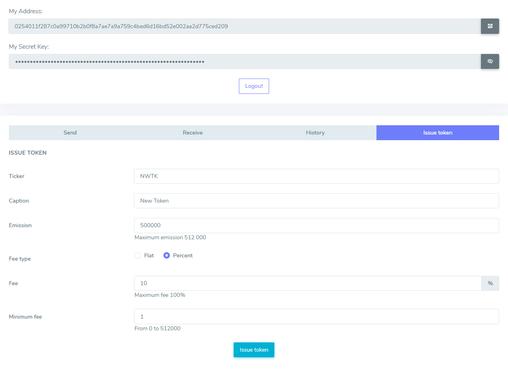

# Как выпустить собственные токены

Вместе с Enecuum вы можете использовать протокол Trinity (комбинацию PoA, PoS и PoW узлов) наряду с ETM (Enecuum Token Machine), делегировать средства на PoS узлы (смарт стейкинг), выпускать различные виды токенов – майнинговые, с нефиксированной эмиссией и другие.

## Типы токенов

В сети Enecuum существует три типа пользовательских токенов:

- C фиксированной эмиссией - токены, для которых невозможен выпуск дополнительных монет.
- С не фиксированной эмиссией - токены с возможностью дополнительно эмитировать или сжигать монеты.
- Майнинговые - токены с возможностью майнинга на мобильных устройствах.  Некоторый объем монет выбирается для мгновенного выпуска (пре-майнинг), а остальной добывается пользователями.

### Общие параметры

Каждый тип токена имеет следующие общие параметры:

- Тикер - уникальный идентификатор токена длиной от 1 до 6 символов.
- Имя - описание токена длиной до 40 символов.
- Тип токена - тип, определяющий работу токена. Типы объяснены в разделе выше.
- Decimals - количество десятичных знаков.
- Эмиссия - количество токенов на момент выпуска.
- Тип комиссии - тип, определяющий, будет ли комиссия фиксированной или процентной.
- Комиссия - сумма комиссии за транзакции с токенами. Комиссия с каждой транзакции будет отправлена на кошелек создателя токена.
- Минимальная комиссия - минимальная комиссия за транзакции с токенами, если тип токена - процентный.

### Параметры майнинговых токенов

Помимо параметров, упомянутых выше, майнинговые токены также имеют следующее:

- Max supply - максимальная эмиссия токенов. Достигнув этого значения, майнить токен больше нельзя.
- Награда за блок - награда за каждый добытый макроблок. В это значение входит реферальное вознаграждение.
- Минимальный стейк - минимальный баланс, необходимый пользователю для начала майнинга.
- Реферальный стейк - минимальный баланс для пользователя, чтобы стать реферальным агентом. Став реферальным агентом, пользователь может поделиться кодом, чтобы получать вознаграждения от блоков, добытых другими. Эта система создает пассивный доход.
- Доля реферала - доля от общего вознаграждения за блок, определяющая размер реферального вознаграждения. Реферальное вознаграждение распределяется между рефералом и его агентом поровну.

### Калькулятор токенов

Вы можете использовать наш [калькулятор токенов](http://pulse.enecuum.com/#!/token-roi), чтобы оценить рентабельность инвестиций в добываемые токены. Этот инструмент может помочь вам спланировать параметры майнинговых токенов на основе ваших ожиданий. Калькулятор покажет, сколько времени потребуется на майнинг вашего токена и какой будет ROI в зависимости от значения премайна и количества поставленных монет.

Вы можете заполнить белые поля желаемыми параметрами. Рассчитанные значения будут отображаться в полях, окрашенных в синий цвет. В центральном столбце отображаются значения токенов, а в правом столбце - те же значения, конвертированные в доллары США.

Имейте в виду, что параметр периода майнинга является приблизительным. Есть факторы, которые сложно учесть в расчетах. Например, нет гарантии, что каждый майнер  токенов примет участие в каждом макроблоке. Соотвественно, раздел эмиссии - это приблизительная оценка.

Чтобы сохранить страницу как файл PDF, нажмите кнопку в правом верхнем углу и выберите «Печать как PDF».

  

## Принцип работы комиссии

С каждой транзакцией, включая пользовательские токены, пользователи должны платить комиссию. При отправке ENQ пользователь платит комиссию 0,1 ENQ в сеть Enecuum. При отправке пользовательских токенов пользователь платит комиссию создателю токена. Размер комиссии устанавливается создателем токена. С каждой транзакцией пользовательского токена его эмитент платит комиссию 0,1 ENQ сети Enecuum.

Эмитент токена также выбирает тип комиссии. Комиссия может быть фиксированной или процентной. Фиксированная комиссия остается неизменной для любой транзакции. Процентная комиссия зависит от суммы транзакции. Если выбран процентный тип, эмитент токена также может установить минимальную комиссию. В этом случае пользователь будет платить минимальную комиссию, если процентная комиссия окажется меньше.

  

Пример работы комиссии:

1. Кэрол создает собственный токен CRL. Она устанавливает фиксированный тип комиссии за транзакцию. Также она устанавливает размер комиссии 1 CRL. Кэрол платит комиссию в ENQ на адрес Enecuum Genesis за создание токена.
2. Алиса отправляет Бобу 10 CRL. Она платит Кэрол комиссию 1 CRL. Боб получает 10 CRL.
3. Кэрол платит комиссию 0,1 ENQ на адрес Enecuum Genesis за транзакцию, отправленную Алисой.

## Слоты для майнинга

Чтобы обеспечить согласованность майнинга пользовательских токенов, мы реализуем так называемые **«слоты для майнинга»** — дополнительные правила публикации микроблоков, которые обеспечивают предсказуемое время эмиссии пользовательского токена в случае постоянного ненулевого количества майнеров в сети.

Макроблоки выпускаются каждые 15 секунд и состоят из микроблоков, созданных майнерами PoA. Если все майнеры имеют равную вероятность создать микроблок, то нет гарантии, что конкретный токен или даже нативная монета будут добыты в макроблоке.  Слот для майнинга - это исключительное место в макроблоке для определенных майнеров токенов. Он позволяет майнерам токенов со слотом соревноваться только между собой, а не с другими майнерами токенов. Поскольку размер макроблока ограничен, эти слоты будут распределяться на конкурентной основе. На данный момент в макроблоке доступно 10 слотов для пользовательских токенов. Всегда есть один дополнительный слот для нативной монеты (ENQ) и один случайный слот (с ним можно добыть любой токен для майнинга).

В случайных слотах все добываемые токены, включая ENQ, будут соревноваться на равных условиях. Чем больше майнеров у токена, тем больше вероятность, что он получит случайный слот.

### Как получить слот

::: tip СОВЕТ
Наличие слота для майнинга полезно. Без слотов стабильность эмиссии токенов не гарантируется из-за конкуренции между майнерами разных токенов.
:::

Есть два требования для получения слота для майнинга для вашего токена:

1. Среди владельцев майнинговых токенов вы должны входить в первую десятку кошельков, отсортированных по доступному балансу ENQ (т.е. балансы «делегировано», «отозвано», «транзит» и «награда» не учитываются).
2. У вас должно быть не менее 500 000 ENQ.

Владельцы слотов определяются при создании каждого макроблока, и если ни у кого нет минимально необходимого баланса, то слоты будут считаться случайными. Если ваш кошелек соответствует требованиям и владеет несколькими майнинговыми токенами, слот будет разделен между всеми вашими токенами с распределением на основе следующего правила: чем больше майнеров у токена, тем больше вероятность, что токен будет смайнен.

### Пример слота для майнинга

Пример, иллюстрирующий правила слотов для майнинга:

| Владелец токена |  Токен(ы)  | Активные майнеры | Доступный баланс |                                                                                      Шанс майнинга                                                                                     |
|:---------------:|:----------:|:----------------:|:----------------:|:--------------------------------------------------------------------------------------------------------------------------------------------------------------------------------------:|
| Алиса           | ALC        | 100              | 700 000 ENQ      | Слот гарантирован. Токен будет добываться каждый макроблок. Низкая вероятность получить случайный слот из-за небольшого количества майнеров.                                           |
| Боб             | BOB1, BOB2 | 100, 1           | 500 000 ENQ      | Слот гарантирован. Токены будут добываться каждый макроблок. Вероятность добыть BOB1 выше, чем BOB2. Низкая вероятность получить случайный слот из-за небольшого количества майнеров.  |
| Кэрол           | CRL        | 2 000            | 300 000 ENQ      | Недостаточно доступного баланса для гарантированного слота. Получит большинство случайных слотов из-за большего количества майнеров.                                                   |
| Дейв            | DVE        | 1 000            | 200 000 ENQ      | Недостаточно доступного баланса для гарантированного слота. Вероятность получить случайный слот ниже по сравнению с CRL и ENQ.                                                         |
| Enecuum         | ENQ        | 1 500            | --               | Слот гарантирован. Токен будет добываться каждый макроблок. Может получить случайный слот.                                                                                             |

В этом примере 2 слота для майнинга зарезервированы Алисой и Бобом, потому что они соответствуют требованиям. Их токены будут добываться с каждым макроблоком. Один слот всегда зарезервирован для ENQ. Остальные слоты для майнинга становятся случайными. Учитывая один дополнительный слот, общее количество случайных слотов становится равным 9. Каждый токен в этой таблице может бороться за 9 случайных слотов для майнинга. Поскольку у Кэрол больше майнеров, она получит больше слотов, но майнинг не будет стабильным. В случае, если другие токены получат больше майнеров, шанс смайнить токен CRL значительно упадет.

## Выпуск токенов в сети Enecuum

Вы можете создать собственный токен через мобильное приложение Enecuum или на своем компьютере, используя наш веб-сайт.

### Через приложение

1. Перейдите на [pulse.enecuum.com](https://pulse.enecuum.com/) и загрузите приложение Android через верхнее меню. Перейдите к Как майнить -> Скачать приложение.
2. Создайте кошелек и сохраните секретный ключ. Без секретного ключа вы не сможете восстановить свой аккаунт.
3. Получите 1000.1 ENQ. Вы можете купить ENQ на биржах.

  

4. Щелкните значок в правом нижнем углу, чтобы открыть интерфейс выдачи токена. Эта функция предоставляется любому пользователю сети Enecuum. Функции выпуска новых токенов включены в протокол. От пользователя требуется только указать параметры токена.

5. Заполните необходимые параметры.

  

6. Подтвердите выпуск вашего нового токена. Вы получите сообщение об успешном создании токена. 1000.1 ENQ будет списано с вашего счета.

  

7. Затем перейдите на вкладку «Баланс токенов» на главном экране. Здесь вы можете увидеть ENQ и балансы своих недавно созданных токенов.

### Через веб-интерфейс

1. Перейдите на [wallet.enecuum.com](https://wallet.enecuum.com/). Войдите в систему с вашим секретным ключом или создайте учетную запись. Обязательно сохраните секретный ключ. Без него вы не сможете восстановить свой аккаунт.
2. Получите как минимум 1000.1 ENQ. Вы можете купить ENQ на биржах.
3. В конце страницы кошелька доступно несколько опций: «Отправить», «Получить», «История», «Выпуск токена». Щелкните последнюю вкладку.

  

4. Заполните необходимые параметры.

  

5. Подтвердите выпуск вашего нового токена. Вы получите сообщение об успешном создании токенов. 1000.1 ENQ будет списано с вашего счета. 

  

6. На вкладке «История» вы должны увидеть транзакцию 1000.1 ENQ. Если статус транзакции «подтверждено», это означает, что вы успешно выпустили собственный токен. В противном случае должна быть ошибка в заполненных параметрах. 

  

## Добавление описания пользовательского токена

При желании вы можете добавить описание на разных языках и ссылки на социальные сети к своему пользовательскому токену.

1. Сделайте ответвление (форк) [репозитория блокчейн эксплорера](https://github.com/Enecuum/explorer) Enecuum.
2. Добавьте описание токена в файл `assets/info/token-info-storage-enq.json`. Используйте в качестве примера существующие данные.

::: tip СОВЕТ
При желании вы можете указать **coingecko-id**. Он используется в Enecuum Blockchain Explorer, приложении для майнинга и кошельке для автоматического отображения цены токенов. Если ваш токен указан на CoinGecko, вы можете получить coingecko-id из адреса вашей страницы CoinGecko. Например, coingecko-id токена Nayuta Coin ([https://www.coingecko.com/en/coins/nayuta-coin](https://www.coingecko.com/en/coins/nayuta-coin)) — nayuta-coin.
:::

3. Сделайте запрос на включение (pull request). Вы можете использовать [pull request от Genesis Lab](https://github.com/Enecuum/explorer/pull/2) в качестве примера. Обратите внимание, что в примере описывается PoS-контракт, но описание пользовательского токена выполняется аналогичным образом.
4. В [веб-кошельке](https://wallet.enecuum.com/) перейдите на вкладку «Отправить».

  

5. В поле «Количество» введите 0. В поле «Адрес» введите `02833f453fb8bf10cc5e8fd362d563851543559f3ea6e662ef114d8db8f72dda19` для сети Pulse (ENQ) и `029dd222eeddd5c3340e8d46ae0a22e2c8e301bfee4903bcf8c899766c8ceb3a7d` для сети BIT. В поле «Данные» введите номер запроса на включение и подтвердите транзакцию.

  

6. Подождите, пока транзакция будет обработана. Внизу страницы найдите транзакцию, которая была выполнена на предыдущем шаге. Возможно, вам придется несколько раз перезагрузить страницу.

  

7. Скопируйте хеш транзакции.

  

8. В запросе на включение оставьте комментарий с хешем транзакции. Подождите, пока команда рассмотрит ваш запрос.

  

## Ошибки при выпуске токенов

Если вы видите ошибку при выпуске собственного токена, причин может быть несколько:

- У вас недостаточно средств для выпуска токена. У вас должно быть не менее 1000.1 ENQ. 
- Тикер токена не уникален. Попробуйте ввести другой тикер.
- Награда за блок больше, чем позволяет максимальное количество токенов.
- Максимальное количество токенов меньше эмиссии.
- Эмиссия меньше реферального стейка.
- Реферальный стейк меньше минимального стейка.
- Возможно, вы использовали запрещенные символы. При вводе чисел используйте точку (.) вместо запятой (,). При задании тикера используйте только английские буквы.
