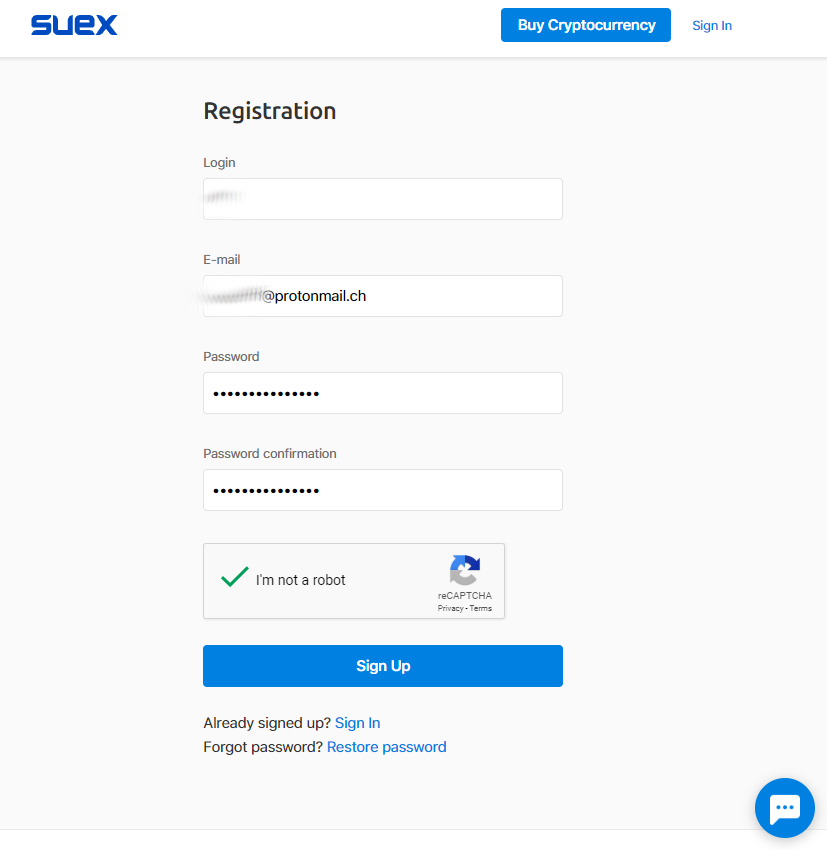
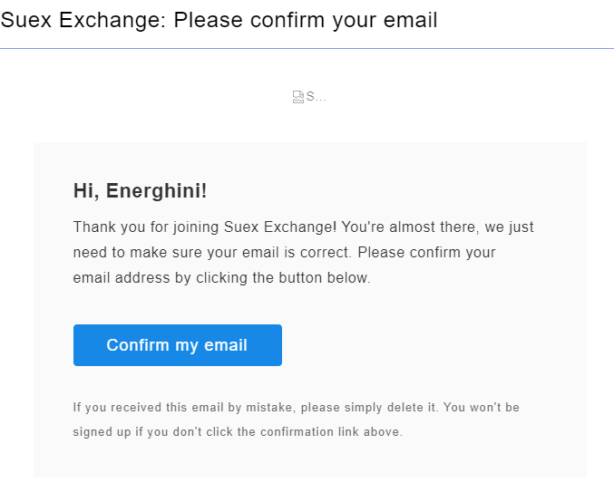
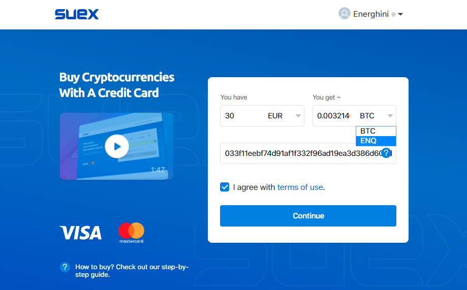
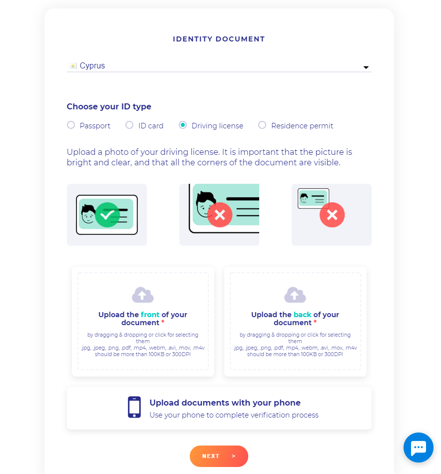
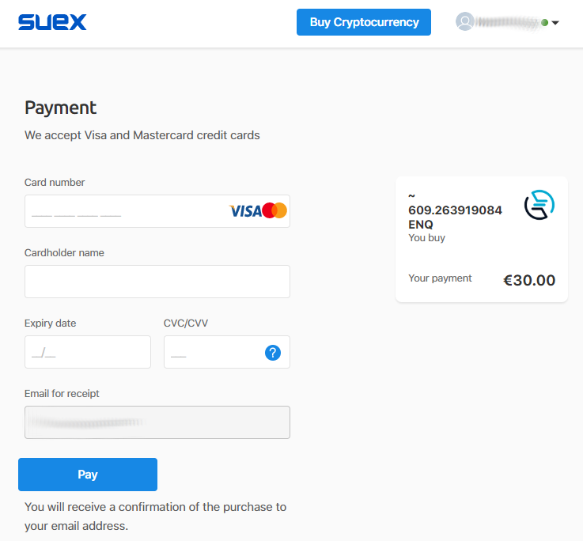
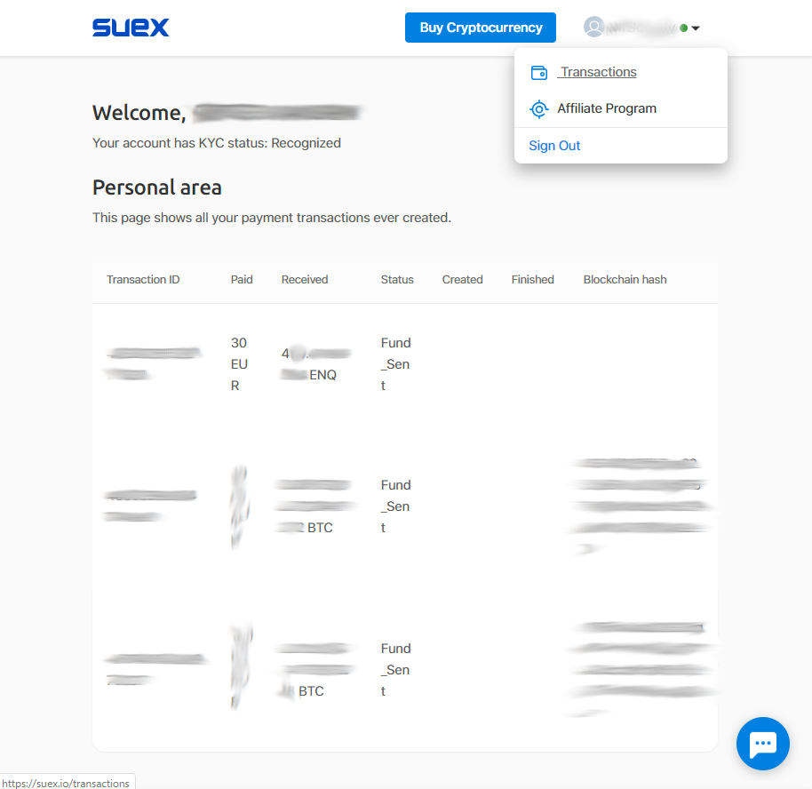

# Как купить ENQ банковской картой

::: warning ВНИМАНИЕ
Для покупки криптовалюты банковской карты необходимо пройти процедуру KYC. **Только граждане определённых стран могут произвести покупку**. Пожалуйста, обратитесь в поддежку suex.io за дополнительной информацией.

Обратите внимание, что Вам нужно ввести нативный адрес ENQ кошелька в качестве адреса отправления, чтобы получить покупку. **Адреса Enecuum начинаются с *02* и *03*.**
:::

::: tip СОВЕТ
Приобритение нативных монет ENQ позволяет **сразу начать майнинг.** Нет необходимости делать своп. Пожалуйста, следуйте инструкции ниже шаг за шагом.
:::

## Как купить нативные ENQ

Существует два вида ENQ. Токены, основанные на Ethereum (мы называем их "ERC20 ENQ"), использовались во время закрытой продажи в 2018 году и позже были представлены на различных биржах и системах оплаты, т.к. стандарт ERC20 обеспечивает простоту интеграции. В то же время была запущена независимая сеть Enecuum, которая теперь доступна для мобильного майнинга с вознаграждениями нативными ENQ монетами сети Enecuum. На данный момент единственный способ купить нативные монеты ENQ сразу через приложение без использования кошелька Metamask или газа Ethereum - воспользоваться услугами нашего партнёра [suex.io](https://suex.io/). Единственный недостаток такого решения - покупка нативных ENQ требует прохождения процедуры идентификации KYC; также возможны ограничения в некоторых странах. Если Вам не подходят эти условия, попробуйте [купить ERC20 ENQ на бирже](how-to-buy) и [сделать своп](how-to-swap).

## Покупка ENQ банковской картой на [suex.io](https://suex.io/)

::: tip СОВЕТ
Обратите внимание, что SUEX имеет ограчение в виде **2 транзакций в день**.

В случае если сайт SUEX не загружается, возвращает ошибки или работает неправильно, **очистите кэш браузера** или откройте сайт в **приватном окне** браузера.
:::

- Зарегистрируйтесь на [suex.io](https://suex.io).
    - Введите Ваш логин, электронную почту и пароль.
      
    
  

      
    - Подтвердите Ваш пароль.
    
    
  

    
- Пройдите процедуру KYC (требуется только один раз).
  
    - Загрузите suex.io и закажите покупку. Обратите внимание, что Вам нужно ввести нативный адрес ENQ кошелька в качестве адреса отправления. **Адреса Enecuum начинаются с *02* и *03*.**
    
    
  

    
    - Процедура KYC начнётся автоматически.
    
    - Следуйте инструкциям; сделайте фотографию паспорта с двух сторон, а также селфи с паспортом.
    
    
  

- Совершите покупку банковской картой. Введите данные вашей карты. 
  
::: warning ВНИМАНИЕ
**В поле ввода имени введите имя, которое указано у вас в профиле, а не имя на вашей карте**. Имя распознаётся во время процедуры KYC и, соотвественно, появляется в профиле после её прохождения. Чтобы его увидеть, нажмите на Ваш аватар и выберите графу "Транзакции". 
:::
  

  

Вы можете увидеть историю покупок в разделе ["Транзакции"](https://suex.io/transactions).

  

Связаться с поддержкой SUEX можно с помощью интегрированного чата на странице сайта. Чтобы начать разговор с поддержкой, нажмите на значок в правом нижнем углу.