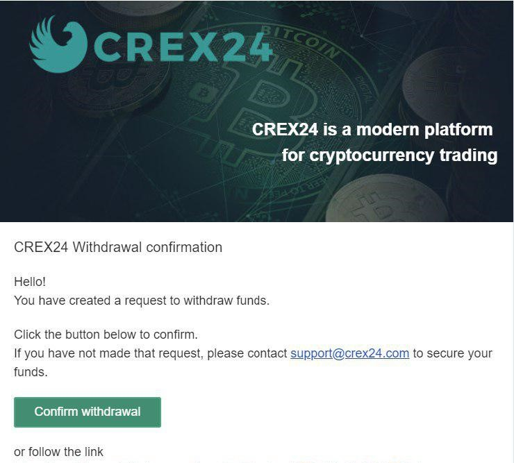

# Как купить ENQ

::: danger ВНИМАНИЕ
**НЕ ОТПРАВЛЯЙТЕ КУПЛЕННЫЕ ТОКЕНЫ НАПРЯМУЮ НА АДРЕС ENQ.** Это НЕ сработает.

После покупки ENQ ERC-20 токенов, необходимо **отправить их на Ethereum адрес и совершить своп (конвертацию).** Своп необходим, т.к. Enecuum - тестнет проект, в котором используются тестнет монеты, и ими нельзя торговать. Пожалуйста, следуйте инструкции ниже шаг за шагом. Инструкцию по совершению конвертации можно найти внизу руководства.
:::

::: tip СОВЕТ
ENQ доступен на [нескольких биржах](https://enecuum.com/Buy.html). Это руководство объясняет покупку на бирже Crex24.
:::

## Как пополнить счет на [CREX24](https://crex24.com/)

Перейдите на страницу "Счёт". Выберите валюту в поле поиска. Например, RUB. Затем в столбце "Пополнить" нажмите на значок ”+ с изображением наличных денег" в строке с выбранной валютой для депозита.

Способы оплаты:

- Банковские карты;
- Электронные кошельки;
- Платежные системы;

Когда вы выберете необходимый способ, появится окно, в котором Вы можете ввести сумму для депозита. Оно также будет содержать все условия для выбранной вами валюты. После ввода суммы и согласования с условиями, Вы перейдете в окно подтверждения транзакции. Для пополнения некоторых фиатных валют вам потребуется верификация учетной записи. На этом этапе у Вас будут подробные руководства непосредственно внутри биржи.

Также, в этих окнах будут отображаться комиссии и минимальные суммы пополнения. Будьте внимательны.

  

## Как купить или продать токен ENQ

- Перейдите на [сайт Crex24](https://crex24.com/), нажмите кнопку “Войти” и введите данные для входа в систему. 

  

- В разделе “Рынки” в строке поиска введите ENQ.

  

- Затем Вы обнаружите разные способы покупки токенов - за BTC, RUB или USD. Выберите подходящий для Вас. Ниже, в разделе “Купить ENQ”, будут расположена валютная пара для торговли. Если, например, в предыдущем шаге Вы выбрали RUB, то данная пара будет будет ENQ/RUB соответственно (или другая пара, в зависимости от той, какую Вы выбрали из доступных).

- Перейдите в раздел ордеров ENQ/RUB. В журнале ордеров выберите ордер с лучшей ценой и количеством ENQ. Нажмите на него, и данные из этого заказа будут перемещены в раздел “Купить ENQ”.

  

- На этом этапе Вы можете изменить количество и цену токенов перед завершением заказа. Если Вы согласны с условиями выбранного заказа, нажмите кнопку “Купить”. После этого заказ попадет в книгу заказов и будет ждать его завершения. Через какое-то время транзакция будет завершена, и на Вашем балансе появятся токены ENQ. 

  

## Как вывести средства

::: danger ВНИМАНИЕ
**НЕ ОТПРАВЛЯЙТЕ КУПЛЕННЫЕ ТОКЕНЫ НАПРЯМУЮ НА АДРЕС ENQ** Это НЕ сработает.

После покупки ENQ ERC-20 токенов, необходимо **отправить их на Ethereum адрес и совершить своп (конвертацию).** Своп необходим, т.к. Enecuum - тестнет проект, в котором используются тестнет монеты, которыми нельзя торговать. Пожалуйста, следуйте инструкции ниже шаг за шагом. Инструкции по совершению конвертации можно найти внизу руководства.
:::

- Перейдите на [сайт Crex24](https://crex24.com/), нажмите кнопку “Войти” и введите данные для входа в систему. 

  

- Перейдите в раздел “Счёт”. Выберите валюту - ENQ.

 

- Нажмите на иконку “Вывести”. Заполните все необходимые поля. **Пожалуйста, введите адрес кошелька *Ethereum*, а не *Enecuum*.** Адреса Ethereum начинаются с *0x*, а адреса Enecuum - с *02* или *03*. В качестве кошельков Ethereum мы рекомендуем MetaMask или Trust Wallet.

 

- Следуйте инструкциям в полученном электронном письме.

  

- Для дальнейшего использования ENQ в приложении следуйте инструкции [Как сделать своп ENQ](how-to-swap.md).

### Почему я не могу вывести свои средства?

1. Вывод может занять до 72 часов, если пароль был изменен. Вы будете уведомлены об этом по электронной почте. Если Вы не меняли пароль, обратитесь в [Службу Поддержки Клиентов](https://crex24.com/contact).
2. С вашего счета был обнаружен необычный трафик. Для дополнительной защиты вывод средств может быть ограничен. Пожалуйста, обратитесь в [Службу Поддержки Клиентов](https://crex24.com/contact).
3. Вы вводите адрес Enecuum кошелька вместо адреса Ethereum. Адреса Ethereum начинаются с *0x*, а адреса Enecuum - с *02* или *03*.

Если у Вас есть вопросы, перейдите в [FAQ](faq.html#покупка-и-своп). Если проблема не решилась, прочитайте раздел ["Решение проблем"](faq.html#покупка-и-своп-2). или свяжитесь с нами в [группе Телеграм](https://t.me/Enecuum_EN).