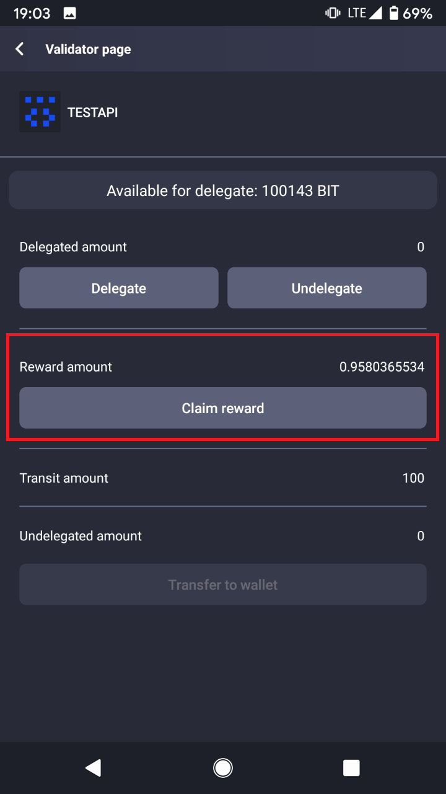
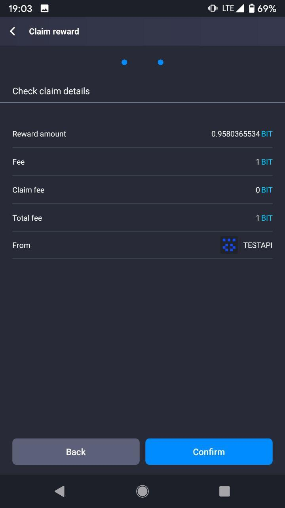
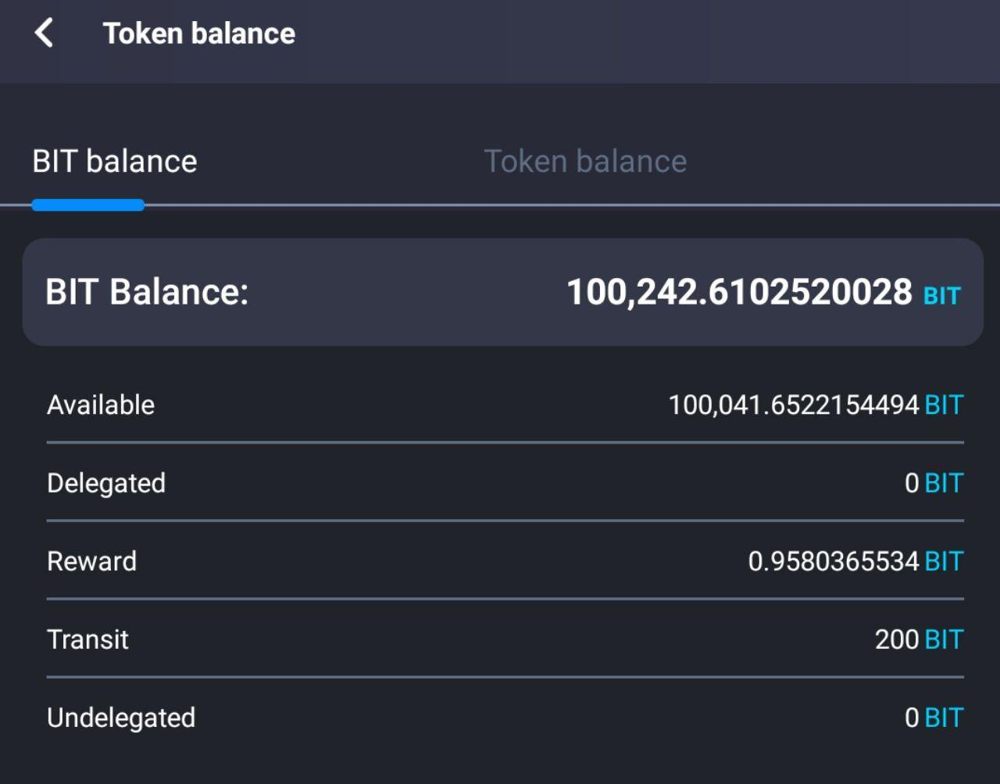

# Как делегировать средства

BIT - это тестовая сеть блокчейна Enecuum. С помощью BIT можно тестировать протокол Trinity (комбинация PoA, PoS и PoW), а также новые функции, такие как ETM (Enecuum Token Machine), делегирование на узлы PoS (делегированный смарт стейкинг), выпуск и тестирование различных типов токенов - для майнинга, NFT и др.

Сеть создана для публичного тестирования для членов сообщества Enecuum, партнеров и разработчиков децентрализованных приложений. Все новые функции, разработанные командой Enecuum, будут публично протестированы в сети BIT, а затем добавлены в основную сеть.

## Как пользоваться BIT

Перейдите на [bit.enecuum.com](https://bit.enecuum.com/), загрузите приложение для Android, создайте кошелек и сохраните свой секретный ключ. Вы также можете создать учетную запись со своего компьютера на [bit-wallet.enecuum.com/login](https://bit-wallet.enecuum.com/login). 

В сети BIT введены комиссии за транзакции, поэтому вам необходимо доплачивать 0,01 BIT за каждый «доступ на запись» в блокчейн, например, при создании PoS-контракта или получении вознаграждения за PoS-стейкинг. Чтобы оплатить комиссию, вы можете получить монеты BIT на [faucet-bit.enecuum.com](https://faucet-bit.enecuum.com/) (25 бит раз в 10 минут для одного адреса).

## Стейкинг и PoS-контракты

Общая идея стейкинга состоит в том, чтобы вносить (или «делегировать») ваши средства на PoS-узлы, чтобы увеличить их долю («stake power»), чтобы оставаться в топ-100 кошельков (поскольку только самые богатые кошельки могут выполнять работу PoS) для получения части наград от PoS-майнинга. Чтобы гарантировать это, эта часть награды рассчитывается полностью, и со временем вводятся PoS-контракты. Эти контракты контролируют делегированные средства таким образом, что их можно использовать только для PoS-майнинга, а делегатор всегда может вернуть монеты.

Для получения прибыли от имеющихся у вас монет вы должны делегировать их в активный контракт PoS. Активный означает, что запущен узел (сервер) PoS, и этот PoS-контракт входит в топ-100 контрактов по доли («stake power»).

Можете представить это так: когда вы создаете PoS-контакт, вы основываете банк. Когда вы делегируете свои средства на PoS-контракт, вы создаёте вклад в банке.

::: warning ВНИМАНИЕ
Для делегирования, отмены делегирования и отправления доступны только нативные монеты системы и только целое количество монет. Это было реализовано специально для достижения целей производительности и масштабируемости. Таким образом, можно сделать ставку минимум на 1 бит (ENQ).
:::

## Стейкинг через веб-кошелек или приложение

Вы можете управлять своими средствами через мобильное приложение или веб-интерфейс. В этом руководстве объясняется алгритм стейкинга через веб-интерфейс. Прежде всего, войдите в свой веб-кошелек и убедитесь, что у вас есть не только средства для делегирования, но и для оплаты транзакций.

### Делегирование 

Выберите PoS-контракт (стейкинг-провайдера), который вы хотите делегировать. Основными параметрами, которые следует учитывать, являются комиссия PoS-контракта и время работы PoS-узла. Количество монет, которое вы передаёте владельцу PoS, определяется величиной комиссии. То, как часто этот контракт PoS получает вознаграждения для своих делегатов, отображается по номеру аптайма (времени работы). В первом обновлении системы показывается только история вознаграждений по контрактам PoS, чтобы оценить время безотказной работы. Подробная статистика будет добавлена шаг за шагом.

  
 
  

После делегирования ваш общий баланс остается неизменным, но делегированное количество монет переходит от «доступного» к «делегированному» балансу. Вы не можете использовать делегированные средства, так как они работают в PoS майнинге, пока вы не совершите отзыв средств («разделегирование»). Но эти средства по-прежнему отображаются в вашем общем балансе, и никто не может использовать ваши средства.

### Отзыв

На вкладке «Мои валидаторы» показаны балансы делегированных средств для PoS-контрактов. Вы можете управлять каждым контрактом PoS для получения вознаграждения или прекращения делегирования. Выберите опцию «отозвать», чтобы снять целое число монет с «делегированного» баланса на «доступный».

  
 
  

::: warning ВНИМАНИЕ
Отзыв средств требует 2 транзакции, следовательно, необходимо оплатить 2 комиссии за транзакции.
:::

### Транзит

Это не действие над средствами, а состояние ваших монет после отзыва. На ваших средствах будет действовать временная блокировка - время, необходимое для того, чтобы монеты стали доступны для перевода на ваш баланс. Эта временная блокировка гарантирует справедливый расчет вознаграждений, исключая возможность одновременного использования одной монеты в двух контактах PoS.

  

### Вывод

Чтобы завершить процедуру отзыва монет («разделегирования»), вы должны перевести отозванные монеты из PoS-контракта на свой «доступный» баланс. Вы должны сделать одну транзакцию вывода для каждой транзакции отзыва по истечении времени блокировки.

  

### Забрать награду

Наконец, вы можете забрать награду, если она доступна. Используйте меню «Мои валидаторы» -> «Управлять» -> «Забрать награду».

  
 
  

## Виды балансов

Процедура стейкинга вводит 5 различных состояний ваших средств, в результате чего получается 5 видов балансов.

-   Доступный: монеты, которые вы можете использовать свободно. Например, делегировать, выполнять транзакции или использовать для майнинга.
-   Делегировано: монеты, которые вы перевели на определенный PoS-контракт, чтобы получить вознаграждение, если контракт принадлежит активному PoS.
-   Транзит: монеты с активной временной блокировкой, которые были отозваны от PoS-контракта. Чтобы монеты перешли из этого состояния в состояние «отозвано», должно истечь время блокировки.
-   Отозвано: монеты, которые больше не делегированы. Их можно свободно переводить на «доступный» баланс с помощью транзакции вывода.
-   Награда: заработок от делегирования средств на PoS-контракт. Эти вознаграждения могут быть прямо переведены на ваш баланс. Мы планируем сделать этот шаг автоматическим с функциями Staking 2.0.

    
  

	
  

	
  
