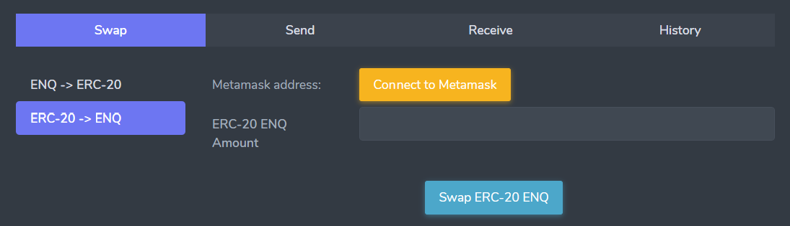
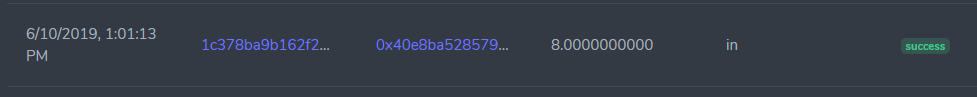

# Как сделать своп ENQ

::: warning ПРЕДУПРЕЖДЕНИЕ
Для того чтобы перевести ERC-20 ENQ в приложение или продать купленные ENQ, **необходимо произвести своп** (конвертацию). Своп обязателен, т.к. Enecuum - проект на стадии тестирования (тестнет), в котором используются тестнет монеты ENQ, которыми нельзя торговать.

Если Вы купили ERC-20 ENQ токены на **бирже**, Вам нужно сначала **вывести** их в **свой Ethereum кошелёк** и затем произвести своп. Более подробные инструкции можно найти в руководстве ["Как купить ENQ на бирже"](how-to-buy.md).
:::

::: danger ВНИМАНИЕ
Для совершения свопа необходимо иметь **Ethereum кошелёк** и **ETH для комиссии за газ.** Комиссия за газ обязательна для конвертации ERC-20 ENQ -> тестнет ENQ. Для конвертации тестнет ENQ -> ERC-20 ENQ комиссии нет. Купить ETH можно купить на биржах тем же способом, что и ENQ.
:::

::: danger ВНИМАНИЕ
Свопы работают только через интерфейс кошелька [wallet.enecuum.com](https://wallet.enecuum.com). Не пытайтесь совершать транзакции на технические адреса свопов Enecuum ни в одном из блокчейнов, ни через прямое API, ни через интерфейс мобильного приложения. **Это НЕ будет работать так, как можно было бы ожидать.**
:::

## Как сделать своп 

Для совершения свопа необходимо иметь Ethereum кошелёк. Ниже представлены инструкции для двух кошельков: MetaMask и Trust Wallet.

В зависимости от вашей операционной системы, Вы можете использовать MetaMask (ПК) или Trust Wallet (Смартфон) кошельки. Они были протестированы командой Enecuum и нашим сообществом. Руководства для этих кошельков отличаются только графическим интерфейсом. Функционал [wallet.enecuum.com](https://wallet.enecuum.com) одинаковый в обоих случаях.

### ENQ (ERC-20) → ENQ (тестнет) Своп

Своп в этом направлении конвертирует [токены Ethereum ERC-20 ENQ](https://etherscan.io/token/0x16ea01acb4b0bca2000ee5473348b6937ee6f72f) в ENQ монеты, используемые для стейка при мобильном майнинге в [тестнете](https://neuro.enecuum.com).

#### MetaMask (ПК)

::: danger ВНИМАНИЕ
Для совершения свопа необходимо иметь **ETH для комиссии за газ.**
:::

Вы можете посмотреть видеоинструкцию или следовать приведенному ниже руководству.

 <iframe width="560" height="315" src="https://www.youtube.com/embed/2SOaK6xQFGQ" frameborder="0" allow="accelerometer; autoplay; encrypted-media; gyroscope; picture-in-picture" allowfullscreen></iframe> 

Чтобы совершить своп, Вам необходимо: 

- Установить [расширение для браузера Metamask](https://metamask.io/).
- [Импортировать аккаунт Ethereum в Metamask.](https://medium.com/publicaio/how-import-a-wallet-to-your-metamask-account-dcaba25e558d) 
- Импортировать ENQ (ERC-20) токен в Metamask, используя адрес пользовательского токена **0x16ea01acb4b0bca2000ee5473348b6937ee6f72f**:

 <iframe width="560" height="315" src="https://www.youtube.com/embed/9EfS3k7NPzg?start=84" frameborder="0" allow="accelerometer; autoplay; encrypted-media; gyroscope; picture-in-picture" allowfullscreen></iframe> 

- Зайти в Ваш кошелек на веб-сайте: [wallet.enecuum.com](https://wallet.enecuum.com).
- Авторизоваться, введя приватный ключ (private key) от аккаунта в тестнете ENQ для свопа.
- Выбрать вкладку "Swap" и направление свопа ERC-20 -> ENQ.
- Нажать “Connect to Metamask”:

  

- Ввести нужное Вам для свопа количество токенов ERC-20, затем нажать “Swap ERC-20 ENQ”.
- Подтвердить транзакцию в Metamask:

  

- В истории будет отложенная транзакция без хэша.
- После достаточного количества подтверждений в блокчейне Ethereum статус транзакции в истории будет изменен на "approved", и транзакция из блокчейна Enecuum будет отправлена на ваш аккаунт тестнета Enecuum.
- После достаточного количества подтверждений в блокчейне Enecuum, статус Вашей транзакции будет изменен на "success" (успех):

  

#### Trust Wallet (Смартфон)

::: danger ВНИМАНИЕ
Для совершения свопа необходимо иметь **ETH для комиссии за газ.**
:::

Чтобы совершить своп, Вам необходимо: 

- Установить Trust Wallet через [Google Play Store](https://play.google.com/store/apps/details?id=com.wallet.crypto.trustapp).  Настроить его с помощью официциального [руководства](https://help.trustwallet.com/hc/en-us/articles/360000973034-Trust-Everything-you-need-to-know-in-one-place).

- Перейти в раздел DApps:

  

- Вввести адрес “wallet.enecuum.com”. Авторизоваться, введя приватный ключ (private key) от аккаунта в тестнете ENQ:

    

- Ввести нужное Вам для свопа количество токенов ERC-20, затем нажать “Swap ERC-20 ENQ”:

 

- По желанию увеличить комиссию за газ, чтобы отправить транзакцию быстрее:

  

- Подтвердить транзакцию.
- В истории будет отложенная транзакция без хэша.
- После достаточного количества подтверждений в блокчейне Ethereum статус транзакции в истории будет изменен на "approved", и транзакция из блокчейна Enecuum будет отправлена на ваш аккаунт тестнета Enecuum.
- После достаточного количества подтверждений в блокчейне Enecuum, статус Вашей транзакции будет изменен на "success" (успех):

  

### ENQ (тестнет) → ENQ (ERC-20) Своп

Своп в этом направлении конвертирует намайненные в [тестнете монеты ENQ](https://neuro.enecuum.com) в [токены Ethereum ERC-20](https://etherscan.io/token/0x16ea01acb4b0bca2000ee5473348b6937ee6f72f). Дополнительное ПО вроде MetaMask и Trast Wallet не требуется, но мы рекомендуем использовать браузер Google Chrome.

Чтобы совершить своп, Вам необходимо: 

- Зайти в Ваш кошелек через веб-сайт: [wallet.enecuum.com](https://wallet.enecuum.com).
- Авторизоваться, введя приватный ключ (private key) от аккаунта в тестнете ENQ для свопа.
- Выбрать вкладку "Swap" и направление свопа ENQ-> ERC-20.
- Ввести сумму, для которой хотите совершить своп (сумма должна быть больше указанного на сайте минимума).
- Ввести адрес вашего кошелька Ethereum для получения токенов ENQ (ERC-20):

  

- Кликнуть на “Swap” и подтвердить транзакцию. Эта транзакция отправит ваши тестнет ENQ монеты на зарезервированный своп кошелек Enecuum:

  

- Вы увидите эту транзакцию в истории свопов со статусом "pending" (ожидание):

  
  

- После достаточного количества подтверждений в блокчейне Enecuum, статус транзакции будет изменен на "approved” (одобрен), и транзакция будет отправлена в блокчейн Ethereum:

  
 

- После достаточного количества подтверждений в блокчейне Ethereum статус транзакции будет изменен на "success” (успех):

  
  

## Статусы в истории свопов

 <b>ENQ (тестнет)  → ENQ (ERC-20) </b> 

| статус               | описание                                                     | чем вызвано                                                  | факторы                                                      |
| -------------------- | ------------------------------------------------------------ | ------------------------------------------------------------ | ------------------------------------------------------------ |
| pending (ожидание)   | транзакция из кошелька пользователя Enecuum отправлена       | отправка своп-транзакции с веб-кошелька                      | своп сервер проверяет блокчейн Enecuum для подтверждения транзакции |
| approved (одобрен)   | транзакция в блокчейне Ethereum отправляется на счет пользователя Ethereum | подтверждение транзакции Enecuum отображается на своп сервере | своп-сервер проверяет блокчейн Ethereum для подтверждения транзакции |
| success (успех)      | транзакция в блокчейне Ethereum подтверждена                 | подтверждение транзакции Ethereum видно на своп сервере      | окончание свопа                                              |
| rejected (отклонено) | транзакция в блокчейне Enecuum недействительна (не соответствует параметрам, заданным пользователем в веб-кошельке) |                                                              |                                                              |

 <b> ENQ (ERC-20)  →  ENQ (тестнет) </b> 

| статус               | описание                                                     | чем вызвано                                                  | факторы                                                      |
| -------------------- | ------------------------------------------------------------ | ------------------------------------------------------------ | ------------------------------------------------------------ |
| pending (ожидание)   | транзакция в блокчейне Ethereum отправляется на счет пользователя Ethereum | отправка своп-транзакции с веб-кошелька с подтверждением Metamask | своп-сервер проверяет блокчейн Ethereum для подтверждения транзакции |
| approved (одобрен)   | транзакция в блокчейне Enecuum отправляется на кошелек пользователя | Подтверждение транзакции Ethereum видно на своп сервере      | своп сервер проверяет блокчейн Enecuum для подтверждения транзакции |
| success (успех)      | транзакция в блокчейне Ethereum подтверждена                 | Подтверждение транзакции Enecuum отображается на своп сервере | окончание свопа                                              |
| rejected (отклонено) | транзакция в блокчейне Ethereum недействительна (не соответствует параметрам, заданным пользователем в веб-кошельке) |                                                              |                                                              |