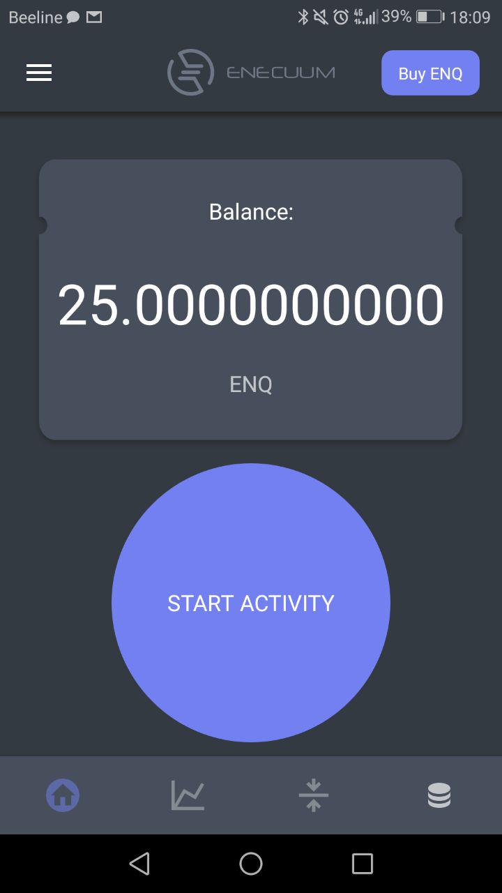

# Как пользоваться приложением

## Как запустить мобильный мастернод

1. Перейдите на сайт [new.enecuum.com](https://new.enecuum.com/#/).

2. Скачайте приложение. Можете воспользоваться этой прямой ссылкой для скачивания приложения - [app.enecuum.com](https://app.enecuum.com/). Установите его через файловый менеджер вашего устройства.

3. Следуя инструкциям на экране, создайте приватный ключ (**очень важно сохранить Ваш приватный ключ** - иначе вы не сможете получить доступ к своим средствам).

## Обзор приложения

Всего имеются 4 основных экрана, с соответствующей клавишей у каждого:

  

### Экран 1. Баланс и Кнопка "Начать работу"

Это основной экран деятельности. Чтобы начать майнить, нажмите на кнопку "Начать работу" и Ваше устройство начнет зарабатывать монеты. **Важное замечание. Чтобы начать майнить, у Вас должно быть на балансе не менее 25 ENQ**. Это мера защиты от спама, а также предоставление дополнительных возможностей для роста ENQ. Если у Вас нет монет, то Вы можете купить их на [бирже](how-to-buy.md), [банковской картой](how-by-card.md) или присоединиться к программе Enecuum bounty (деятельность в социальных сетях, поиск ошибок в приложении, вклад в кодинг и так далее) и заработать себе немного ENQ для старта собственного майнинга. 

  

### Экран 2. Блокчейн Эксплорер

Здесь вы можете посмотреть карту и проверить, сколько людей из каких стран используют приложение в данный момент. Существует также информация о фактическом количестве узлов TPS (транзакций в секунду), максимальный TPS, PoA, PoS и PoW.

  

### Экран 3. Отправить/Получить ENQ

Здесь Вы можете отправить Ваши токены ENQ на другой кошелек. Также Вы можете и получить ENQ, выбрав вкладку "получить". Для отправки токенов введите адрес ENQ кошелька получателя (он может найти его в разделе "Мой адрес" в настройках, а также во вкладке "Получить"), введите сумму ENQ, затем нажмите отправить. Чтобы получить токены, скопируйте ваш адрес ENQ кошелька или отправьте QR-код со вкладки "Получить" тому, кто собирается переслать Вам ENQ.

  

### Экран 4. ROI Калькулятор

ROI калькулятор поможет вам понять, сколько ENQ Вы сможете намайнить ежедневно, еженедельно, ежемесячно и ежегодно. Очень легко проверить прибыль, просто введя сумму стейка (количество ENQ, с которым Вы начинаете майнинг). Вы можете *нажать на свой баланс* или на *Max ROI*, чтобы калькулятор посчитал для него доходность. Чтобы подробнее узнать, как это работает, пожалуйста, обратитесь к [руководству по "ROI Калькулятору"](how-does-roi-work.md).

  

### Остальные экраны

#### Купить ENQ 

Здесь Вы сможете купить больше ENQ. Просто выберите биржу и следуйте [инструкциям](how-to-buy.md). 

  

#### Настройки

Настройки скрыты знаком из 3 горизонтальных линий в левом верхнем углу экрана. Доступны следующие настройки: 

  

- **О приложении.** Здесь вы можете проверить свою версию приложения и найти ссылки на важную документацию Enecuum.

- **Мой адрес.** В этом разделе показан адрес вашего кошелька ENQ. Отсюда можно легко его скопировать, если это необходимо. 

- **Приватный ключ.** Закрытый ключ необходим для доступа к вашим средствам через мобильное приложение или веб-кошелек. **Обязательно сохраните его**.

- **Сообщество**. Ссылка на социальные сети Enecuum. Присоединяйтесь к ним, чтобы следить за всеми обновлениями.

- **FAQ.**  Здесь мы разместили всю важную информацию по часто задаваемым вопросам от нашего сообщества.

- **Язык.** Переключите приложение Enecuum на любой язык, который вам нравится. У нас уже доступно 9 языков и скоро их будет еще больше.