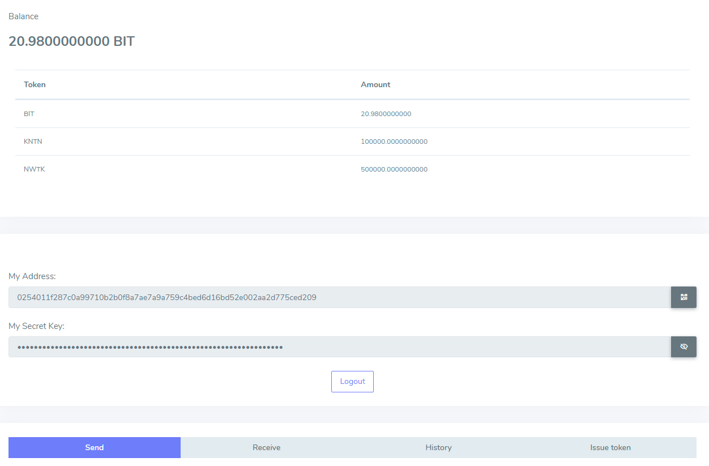

# Как выпустить собственные токены

BIT – тестовая сеть блокчейна Enecuum. Благодаря BIT можно протестировать протокол Trinity (объединяет PoA, PoS и PoW), а также весь новый функционал, такой как ETM (Enecuum Token Machine), делегирование PoS узлам (delegated smart staking), выпуск и тестирование различных видов токенов – майнинговых, NFT и прочих.

Сеть создана  для публичного тестирования участниками сообщества Enecuum, партнерами и разработчиками децентрализованных приложений.

Весь новый функционал, разрабатываемый командой Enecuum, будет проходить публичное тестирование в сети BIT, после чего будет добавлен в боевую сеть.

## Как начать пользоваться сетью BIT

Перейдите на [bit-wallet.enecuum.com](https://bit-wallet.enecuum.com) или загрузите приложение для Android, зарегистрируйте кошелек и сохраните секретный ключ. 

### Через приложение

Чтобы получить 25 BIT на кошелек, перейдите по [ссылке](https://faucet-bit.enecuum.com/) и введите адрес своего кошелька. В течение 5-15 секунд монеты будут зачислены на ваш счет:

  

Нажмите на значок в нижнем правом углу – и вы перейдете к интерфейсу выпуска токенов. Такая возможность предоставляется любому пользователю Enecuum Network. Функции выпуска новых токенов заложены в протокол. От пользователя  требуется лишь указать ключевые параметры.

В нашем случае это «Token name» (название), «Token ticker» (уникальный в рамках системы тикер длиной не больше 10 символов; не изменяется впоследствии), «Token supply» (эмиссия), «Tx fee for users» (комиссия для пользователей токенов), «Decimals» (количество десятичных знаков после запятой). Максимальная эмиссия для тестовых токенов имеет ограничение в  512 000 монет. Заданная эмиссия будет доступна для тестирования через мобильный и браузерный кошелек. Комиссия же бывает фиксированной или процентной. По желанию, эмитент может установить значение минимальной комиссии за транзакцию. Комиссия с каждой транзакции будет поступать на счет создателя токена. 

  

После того, как все поля заполнены, нужно нажать далее и перейти на этап подтверждения выпуска токена.

  

Если данные верны, нужно нажать “подтвердить”, и блокчейн выпустит токены с заданными ранее параметрами. 

Вы получите сообщение об успешном создании токенов. Со счета спишется комиссия за создание токена: 2.01 BIT.

Через некоторое время перейдите на вкладку «Token balance». На ней отображается остаток BIT и только что созданных токенов. 

### Через веб-интерфейс

Алгоритм действий в случае веб-интерфейса похожий, только сами окна отличаются. Под строчками с адресом и приватным ключом размещены опции «Отправить», «Получить», «История», «Создание токена». Нас интересует последняя вкладка. 

  

Заполним уже знакомые поля: «Тикер», «Название», «Эмиссия», «Тип комиссии». Ради разнообразия выберем процентную комиссию и зададим ее минимальное значение. 

  

Снова – окно подтверждения и напоминание о том, что с вас будут удержаны 2.01 BIT. 

  

В верхнем правом углу моргнет уведомление «Transaction was successfully sent». В истории транзакций должна появиться новая транзакция на 2.01 BIT. Если её статус “confirmed”, то создание токена прошло успешно. Если статус “rejected”, то, скорее всего, в процессе заполнения полей токена была допущена ошибка.

  

В Enecuum при выпуске собственного токена будет удерживаться стандартная комиссия в размере 1000 ENQ. Токены будут 3 типов:

- Fungible – все выпущенные токены имеют одинаковую ценность.

- Non-Fungible – каждый выпущенный токен имеет свою уникальную ценность.

- Minable – при выпуске указывается объем токенов для премайн (выпуск сейчас) и объем для майнинга (выпуск с течением времени на устройствах пользователей).

На данный момент можно попробовать выпуск Fungible токенов в тестовой сети BIT.

Еще раз проговорим основные моменты: BIT – тестовая сеть блокчейна Enecuum, бесплатные монеты можно взять на faucet-bit.enecuum.com, токенами BIT нельзя торговать на биржах. Это наглядная эмуляция возможностей Enecuum – без всяких вложений. 