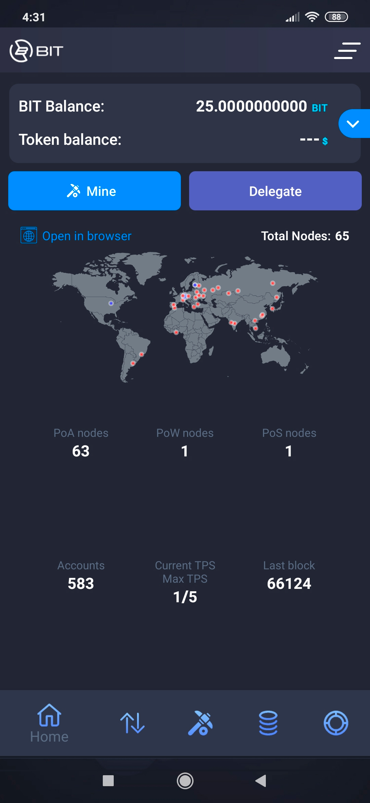
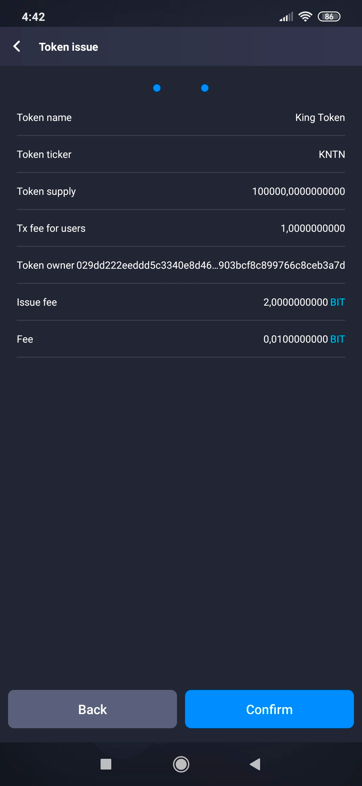

# How to Issue Own Tokens

BIT is a test network of the Enecuum blockchain. With BIT, it is possible to test the Trinity protocol (a combination of PoA, PoS and PoW) as well as new functionality such as ETM (Enecuum Token Machine), delegation to PoS nodes (delegated smart stacking), issuing and testing of different types of tokens - mining, NFT and other tokens.

The network is created for public testing for Enecuum community members, partners and developers of decentralized applications.
All new features developed by the Enecuum team will be publicly tested in the BIT network and then added to the main network.

## How to Use BIT 

Go to bit.enecuum.com, download the Android app, create a wallet and save your secret key. Of course, you can also create an account from your computer at bit-wallet.enecuum.com/login.

### BIT App

To get 25 BIT for your wallet, follow the link faucet-bit.enecuum.com and enter your wallet address. A few minutes later you should receive the coins.

  

Click on the icon in the lower right corner to access the token issue interface. This feature is provided to any Enecuum Network user. The issuing functions of new tokens are included in the protocol. The user is only required to specify the token parameters.

In our case, the parameters are "Token name", "Token ticker" (a unique ticker within the system not longer than 10 characters, it does not change later), "Token supply", "Tx fee for users" (transaction fee for tokens users), "Decimals" (number of decimal places). The maximum emission for test tokens is limited to 512 thousand coins. The specified supply will be available for testing via mobile and browser wallet. The fee can be fixed or percentage. The fee from each transaction will be sent to the wallet of the token creator.

  

After filling out the required fields, you can move on to the next stage by confirming the issuing of your new token.

  

You will receive a message that tokens have been successfully created. 2.01 BIT will be deducted from your account. 

Next, go to the "Token balance" tab. Here you can see BIT and your newly created token balances.

### BIT Wallet

The web interface algorithm  is similar. At the end of the wallet page, there are several options available: "Send", "Receive", "History", "Token issue". We are interested in the last tab.

  

Fill out the fields: "Ticker", "Caption", "Emission", "Fee type". In this example, a percentage fee was chosen. A minimum fee option becomes available for the percentage fee.

  

To finish the process, send the confirmation. You will be charged 2.01 BIT for the token issue. 

  

The notice "Transaction was successfully sent" will blink in the upper right corner. You should see a 2.01 BIT transaction in the “History” tab. If the transaction status is “confirmed”, that means you have successfully issued your own token. Otherwise, there must have been an error in the filled-out parameters. 

  

In the Enecuum network, there will be 3 types of tokens:

- Fungible - all issued tokens have the same value.

- Non-Fungible - each issued token has its own unique value.

- Minable - some volume is selected for instant release (pre-mine) and the rest will be mined by users.

At the moment, you can try releasing Fungible tokens in the BIT test network.

To summarize, BIT is a test network of Enecuum blockchain, free coins can be taken at faucet-bit.enecuum.com, BIT tokens cannot be traded on stock exchanges. This is a clear emulation of Enecuum features - without any investment.
